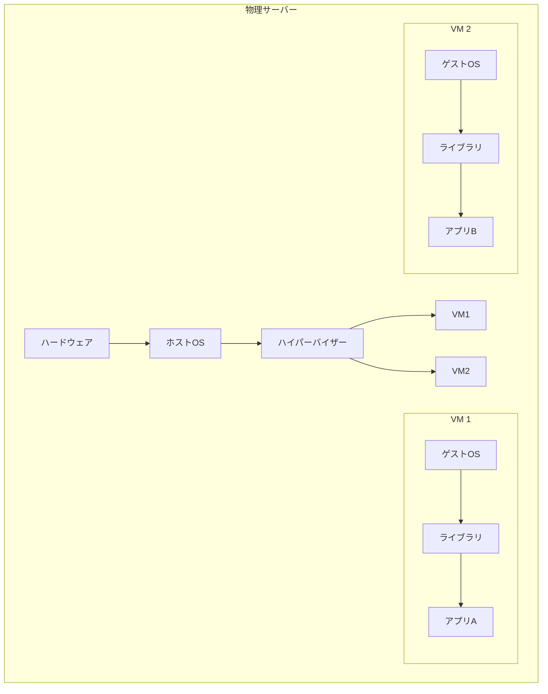
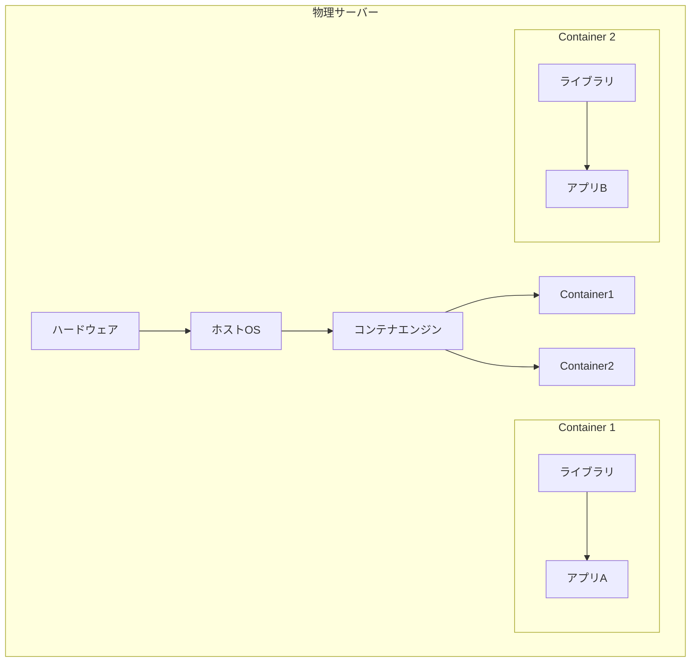
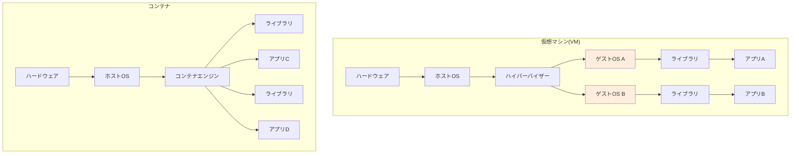
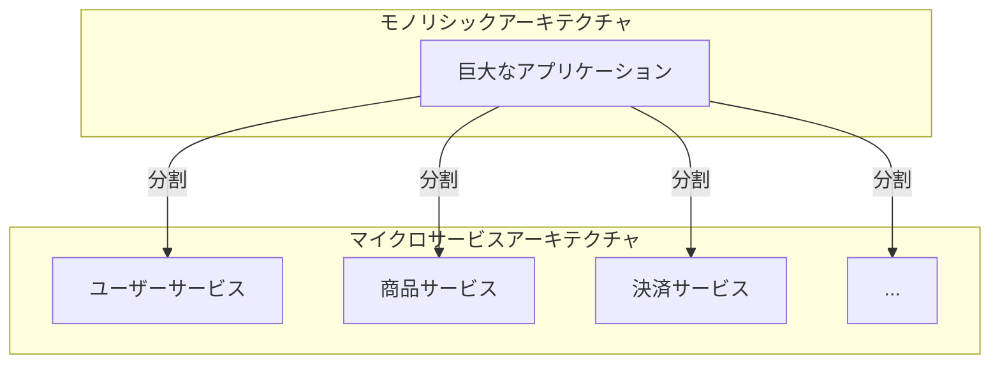

# 第1章: なぜコンテナなのか

### 学習目標

- 従来のアプリケーションデプロイが抱える課題を説明できる。
- 仮想マシン（VM）とコンテナのアーキテクチャの違いを図解で説明できる。
- コンテナがもたらす主要なメリット（ポータビリティ、一貫性、効率性）を理解する。
- コンテナ技術がマイクロサービスアーキテクチャと相性が良い理由を説明できる。

---

## 1. 【See】すべては「環境」から始まった - 従来の課題

あなたが新しいWebアプリケーションを開発し、本番サーバーにデプロイする場面を想像してみてください。開発はあなたのPC（例えばmacOS）で順調に進みました。しかし、本番サーバー（Linux）にソースコードをコピーして実行すると、なぜかエラーで動きません。「自分のPCでは動いたのに！（It works on my machine!）」という、エンジニアが一度は経験するであろう悪夢の始まりです。

原因は、OSの違い、インストールされているライブラリのバージョンの違い、環境変数の設定漏れなど、様々です。このような「環境の差異」が、開発や運用の大きな障壁となっていました。

```mermaid
graph TD
    subgraph 開発者のPC (macOS)
        A[アプリ v1.0] --> B(ライブラリA v1.2)
        A --> C(Ruby v2.7)
    end

    subgraph 本番サーバー (Linux)
        D[アプリ v1.0] --> E(ライブラリA v1.1)
        D --> F(Ruby v2.6)
    end

    A -- デプロイ --> D
    B -- バージョン不一致 --> E
    C -- バージョン不一致 --> F
    D -- "エラー発生！" --> G((X))

    style G fill:#ffcccc,stroke:#ff0000,stroke-width:2px
```

<center>図1-1: 「自分のPCでは動いたのに！」問題</center>

### 仮想マシン(VM)による解決策

この問題を解決するために登場したのが**仮想マシン（Virtual Machine, VM）**です。VMは、物理的なハードウェア（CPU, メモリ, ディスク）をソフトウェアで仮想的に再現し、その上に完全なOS（ゲストOS）を丸ごとインストールします。

アプリケーションは、このゲストOSと必要なライブラリをひとまとめにした「仮想マシンイメージ」としてパッケージングされます。これにより、開発環境と本番環境をOSレベルで完全に一致させることができ、「環境の差異」の問題を解決しました。



<center>図1-2: 仮想マシン(VM)のアーキテクチャ</center>

しかし、VMには新たな課題がありました。各VMが完全なOSを持つため、起動が遅く、ディスク容量も大きく、リソースのオーバーヘッドが大きいのです。1台の物理サーバーで稼働できるVMの数には限界がありました。

## 2. 【See】より軽量な解決策 - コンテナの登場

そこで登場したのが**コンテナ（Container）**です。コンテナは、VMのようにOSを丸ごと仮想化するのではなく、ホストOSのカーネルを共有し、アプリケーションとその実行に必要なライブラリや設定のみを隔離された空間（コンテナ）にパッケージングします。



<center>図1-3: コンテナのアーキテクチャ</center>

VMとコンテナのアーキテクチャを比較すると、その違いは一目瞭然です。



<center>図1-4: VMとコンテナのアーキテクチャ比較</center>

コンテナはゲストOSを持たないため、以下のような大きなメリットが生まれます。

- **軽量かつ高速:** OSの起動プロセスが不要なため、数秒で起動します。イメージサイズもVMに比べて格段に小さいです。
- **高効率:** ホストOSのカーネルを共有するため、メモリやCPUのオーバーヘッドが非常に少ないです。1台のサーバーでより多くのコンテナを稼働させられます。
- **高いポータビリティ:** コンテナイメージは、Dockerなどのコンテナエンジンが動く環境であれば、どこでも同じように動作します。開発PC、テストサーバー、本番クラウド環境など、場所を選びません。

## 3. 【See】コンテナとマイクロサービス

コンテナの「小さく、独立して、どこでも動く」という特性は、**マイクロサービスアーキテクチャ**と非常に相性が良いです。

モノリシックな巨大アプリケーションを、機能ごとに独立した小さなサービス（マイクロサービス）に分割し、それぞれを別のコンテナとして開発・デプロイします。



<center>図1-5: モノリスからマイクロサービスへ</center>

各サービスは独立したコンテナなので、お互いに影響を与えることなく、個別に開発、デプロイ、スケール（拡張）できます。例えば、アクセスが集中するサービスだけを増やす、といった柔軟な対応が可能になります。

## 4. 【Do】コンテナのポータビリティを体験する

百聞は一見に如かず。実際にコンテナを動かして、その手軽さを体験してみましょう。
（ここでは、Dockerがインストールされていることを前提とします。詳細は第2章で解説します）

ターミナルを開いて、以下のコマンドを実行してください。

```bash
# 1. "hello-world"コンテナを実行
$ docker run hello-world

Unable to find image 'hello-world:latest' locally
latest: Pulling from library/hello-world
...
Status: Downloaded newer image for hello-world:latest

Hello from Docker!
This message shows that your installation appears to be working correctly.
...
```

何が起きたのでしょうか？

1. `docker run` はコンテナを実行するコマンドです。
2. Dockerは `hello-world` という名前のイメージをあなたのPC（ローカル）で探しました。
3. 見つからなかったので、インターネット上のDocker Hubという場所からイメージをダウンロードしました。
4. ダウンロードしたイメージを元にコンテナを起動し、メッセージを表示して終了しました。

この`hello-world`イメージは、誰がどこで実行しても、全く同じ結果になります。これがコンテナの持つ**一貫性**と**ポータビリティ**です。

次にもう少し実用的な例を試します。WebサーバーであるNginxを動かしてみましょう。

```bash
# 2. Nginxコンテナを実行
$ docker run --rm -p 8080:80 nginx

# --rm: コンテナ停止時に自動で削除するオプション
# -p 8080:80: あなたのPCの8080番ポートを、コンテナの80番ポートに接続するオプション
```

コマンドを実行した後、Webブラウザで `http://localhost:8080` にアクセスしてください。「Welcome to nginx!」というページが表示されれば成功です。

あなたはNginxをインストールも設定もしていません。ただ一行のコマンドを実行しただけで、完全に動作するWebサーバーが手に入りました。不要になれば、ターミナルで `Ctrl + C` を押してコンテナを停止するだけです。環境が汚れることもありません。

## 5. まとめ

- 従来のデプロイは、OSやライブラリのバージョン違いによる「環境差異」の問題を抱えていた。
- 仮想マシン(VM)はOSごとパッケージングすることで環境差異を解決したが、リソース効率が悪かった。
- コンテナはホストOSのカーネルを共有することで、軽量・高速・高効率を実現した。
- コンテナは「イメージ」としてパッケージ化され、どこでも同じように動く高いポータビリティを持つ。
- この特性は、機能ごとにサービスを分割するマイクロサービスアーキテクチャと非常に相性が良い。

## 6. 【Check】理解度チェック

学んだ知識が本当に身についたか、いくつかの問いで確認してみましょう。

1.  あなたのチームが「開発者のPCでは動くのに、テストサーバーでは動かない」という問題に頻繁に直面しているとします。この章で学んだ知識を基に、コンテナがどのようにこの問題を解決できるか説明してください。
2.  仮想マシン(VM)とコンテナの最も大きな違いは何ですか？リソース効率の観点から説明してください。
3.  先ほどハンズオンで実行した `docker run --rm -p 8080:80 nginx` というコマンドは、あなたのPCにどのような影響を与えましたか？もしこのコマンドを使わずにNginxを動かそうとした場合、どのような手順が必要になるか想像してみてください。
