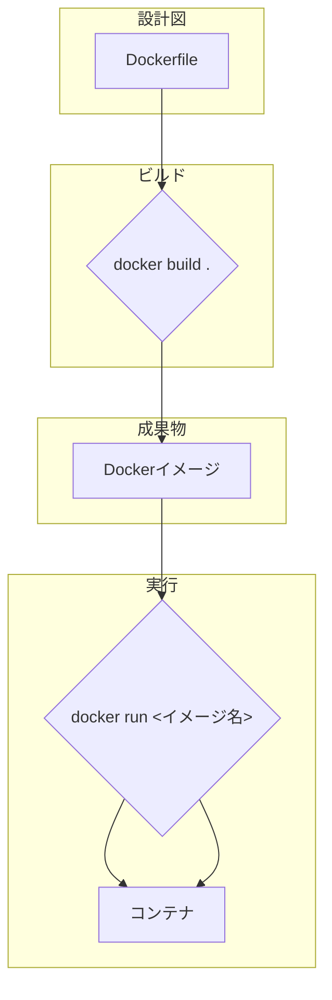

# 第2章: Docker ハンズオン

### 学習目標

- `Dockerfile` を使って、アプリケーションのカスタムイメージをビルドできる。
- ビルドコンテキストと `.dockerignore` の役割を理解し、不要なファイルがイメージに含まれないようにする。
- Dockerのレイヤーキャッシュの仕組みを理解し、効率的な `Dockerfile` を書ける。
- マルチステージビルドを使って、本番用のイメージサイズを劇的に削減できる。
- `Docker Compose` を使って、複数のコンテナで構成されるアプリケーションを定義し、管理できる。

---

## 1. 【See】Dockerfile: コンテナの設計図

第1章では `docker run` コマンドで既存のイメージを動かしました。しかし、自分のアプリケーションを動かすには、そのアプリケーションを含んだカスタムイメージを作成する必要があります。その設計図となるのが `Dockerfile` です。

`Dockerfile` は、ベースとなるOSイメージ、アプリケーションコードのコピー、必要なライブラリのインストール、そしてコンテナ起動時に実行するコマンドなどを記述したシンプルなテキストファイルです。`docker build` コマンドがこの設計図を読み込み、手順を上から順に実行して、最終的にコンテナイメージを生成します。



<center>図2-1: Dockerfileからコンテナ実行までの流れ</center>

## 2. 【Do】Node.js アプリケーションのコンテナ化

それでは、先ほど作成したNode.jsアプリケーション (`src/apps/nodejs-hello`) をコンテナ化していきましょう。このディレクトリに `Dockerfile` という名前のファイルを新規作成し、以下の内容を記述します。

**`professional-kubernetes-hands-on/src/apps/nodejs-hello/Dockerfile`**

```dockerfile
# ベースイメージを指定
FROM node:18-slim

# アプリケーションディレクトリを作成
WORKDIR /app

# アプリケーションの依存関係をコピー
COPY package*.json ./

# 依存関係をインストール
RUN npm install

# アプリケーションのソースコードをコピー
COPY . .

# アプリケーションがリッスンするポートを公開
EXPOSE 3000

# コンテナ起動時に実行するコマンド
CMD [ "node", "index.js" ]
```

### Dockerfileの各命令の解説

- `FROM`: ベースとなるイメージを指定します。ここではNode.js v18のスリム版 `node:18-slim` を使用します。
- `WORKDIR`: コンテナ内での作業ディレクトリを指定します。これ以降の命令は、この `/app` ディレクトリ内で実行されます。
- `COPY`: ホストマシン（あなたのPC）のファイルをコンテナ内にコピーします。
- `RUN`: コンテナ内でコマンドを実行します。ここでは `npm install` を実行して、`package.json` に書かれた依存ライブラリをインストールします。
- `EXPOSE`: コンテナが外部に公開するポート番号を指定します。これはドキュメント的な意味合いが強いです。
- `CMD`: コンテナが起動したときにデフォルトで実行されるコマンドを指定します。

### イメージのビルドと実行

`Dockerfile` が準備できたら、`docker build` コマンドでイメージをビルドします。`src/apps/nodejs-hello` ディレクトリに移動して、以下のコマンドを実行してください。

```bash
# カレントディレクトリに移動
$ cd professional-kubernetes-hands-on/src/apps/nodejs-hello

# イメージをビルド
$ docker build -t nodejs-hello:1.0 .

# -t: イメージに名前とタグを付けます (name:tag)
# .: Dockerfileがある場所（ビルドコンテキスト）を指定します。ここではカレントディレクトリです。
```

ビルドが完了したら、`docker images` コマンドでイメージが作成されたことを確認できます。それでは、ビルドしたイメージを使ってコンテナを起動しましょう。

```bash
# コンテナを起動
$ docker run --rm -p 3000:3000 --name my-hello-app nodejs-hello:1.0

# --name: コンテナに名前を付けます
```

ブラウザで `http://localhost:3000` にアクセスしてください。第1章とは異なり、今度は自作のアプリケーションがコンテナ内で動いていることが確認できます。

## 3. 【See & Do】ビルドの効率化と最適化

### .dockerignore

`docker build` を実行した際、カレントディレクトリ（ビルドコンテキスト）にある全てのファイルがDockerデーモンに送られます。`node_modules` のような巨大なディレクトリは、ホストPCにあってもコンテナ内では `npm install` で生成されるべきなので、コピーする必要はありません。`.dockerignore` ファイルを作成し、不要なファイルやディレクトリを指定します。

**`professional-kubernetes-hands-on/src/apps/nodejs-hello/.dockerignore`**

```
node_modules
npm-debug.log
Dockerfile
.dockerignore
```

### レイヤーキャッシュの活用

Dockerイメージは、`Dockerfile` の各命令がそれぞれ「レイヤー」として積み重なってできています。`docker build` を再実行する際、Dockerは命令とその内容が変わっていなければ、以前のビルドで作成したキャッシュ（中間レイヤー）を再利用します。これにより、ビルド時間を大幅に短縮できます。

先ほどの `Dockerfile` には、非効率な点があります。ソースコード (`index.js`) を1行変更しただけで `COPY . .` が変化し、それ以降のレイヤー（`RUN npm install` を含む）が全て再実行されてしまいます。

依存関係 (`package.json`) はソースコードほど頻繁には変更されません。そこで、`package.json` のコピーと `npm install` の実行を、ソースコード全体のコピーより先に行うことで、キャッシュを最大限に活用できます。

```dockerfile
# (変更前)
COPY . .
RUN npm install

# (変更後 - 効率的)
COPY package*.json ./
RUN npm install
COPY . .
```

我々の `Dockerfile` は既にこの効率的な書き方になっていますね。

### マルチステージビルド

最終的なコンテナイメージには、アプリケーションの実行に必要なファイルだけが含まれているのが理想です。しかし、ビルド時にだけ必要なツール（コンパイラ、テストライブラリ等）が含まれてしまい、イメージサイズが肥大化することがあります。

**マルチステージビルド**は、`Dockerfile` 内に複数の `FROM` 命令を記述することで、ビルド用の一時的なステージと、本番用の最終的なステージを分離するテクニックです。

例えば、ビルドに `devDependencies` が必要だが、最終イメージには不要なケースを考えます。

**`professional-kubernetes-hands-on/src/apps/nodejs-hello/Dockerfile` (マルチステージ版)**

```dockerfile
# --- ビルダーステージ ---
FROM node:18-slim AS builder
WORKDIR /app
COPY package*.json ./
# ここでは本番用と開発用の両方の依存関係をインストール
RUN npm install
COPY . .
# アプリケーションのビルドやテストをここで実行する（今回は省略）

# --- プロダクションステージ ---
FROM node:18-slim AS production
WORKDIR /app
# ビルダーステージから、本番用の依存関係だけをコピー
COPY --from=builder /app/node_modules ./node_modules
COPY --from=builder /app/package*.json ./
# アプリケーションコードをコピー
COPY --from=builder /app/index.js ./

EXPOSE 3000
CMD [ "node", "index.js" ]
```

この例は少し複雑ですが、`AS` でステージに名前を付け、`COPY --from=<ステージ名>` で他のステージからファイルを選択的にコピーできる点が重要です。これにより、最終的なイメージに不要なファイルが含まれるのを防ぎ、イメージサイズを最小限に抑えることができます。

## 4. 【See & Do】Docker Composeによる複数コンテナ管理

実際のアプリケーションは、Webサーバー、データベース、キャッシュサーバーなど、複数のサービス（コンテナ）が連携して動作することがほとんどです。これらを `docker run` コマンドで一つずつ起動し、ネットワーク設定を行うのは非常に煩雑です。

**Docker Compose** は、複数のコンテナで構成されるアプリケーションを定義し、単一のコマンドで管理するためのツールです。設定は `docker-compose.yml` というYAMLファイルに記述します。

例として、我々のNode.jsアプリにRedis（インメモリキャッシュ）を追加してみましょう。

**`professional-kubernetes-hands-on/src/apps/nodejs-hello/docker-compose.yml`**

```yaml
version: "3.8"

services:
  # Node.jsアプリケーションサービス
  app:
    build: .
    ports:
      - "3000:3000"
    environment:
      - REDIS_HOST=redis

  # Redisサービス
  redis:
    image: "redis:alpine"
```

- `services`: ここに起動したい各コンテナ（サービス）を定義します。
- `app`: 1つ目のサービス。`build: .` でカレントディレクトリの `Dockerfile` を使ってビルドすることを指定します。
- `redis`: 2つ目のサービス。`image:` でDocker Hubの公式Redisイメージを使うことを指定します。

`docker-compose up` コマンドを実行すると、Composeはこのファイルを読み込み、定義された全てのサービス（`app`と`redis`）を起動し、それらを繋ぐための内部ネットワークを自動で作成します。`app`コンテナは、`redis`というホスト名でRedisコンテナにアクセスできます。

```bash
# docker-compose.yml があるディレクトリで実行
$ docker-compose up -d

# -d: バックグラウンドで実行

# 起動中のコンテナを確認
$ docker-compose ps

# 停止
$ docker-compose down
```

## 5. まとめ

- `Dockerfile` は、カスタムコンテナイメージを作成するための設計図である。
- ビルドコンテキスト内の不要なファイルは `.dockerignore` で除外し、ビルドを高速化する。
- `Dockerfile` の命令の順序を工夫することで、レイヤーキャッシュを有効活用し、再ビルドの時間を短縮できる。
- マルチステージビルドは、ビルド用と本番用のステージを分け、最終的なイメージサイズを最小化する強力なテクニックである。
- `Docker Compose` を使うと、複数のコンテナから成るアプリケーションをYAMLファイルで定義し、一括で管理できる。

## 6. 【Check】理解度チェック

1.  あなたのNode.jsアプリケーションのイメージサイズが500MBを超えており、本番環境には大きすぎると指摘されました。この章で学んだ中で、イメージサイズを削減するために最も効果的なテクニックは何ですか？そのテクニックがなぜ有効なのかも説明してください。
2.  アプリケーションのソースコードを1行修正しただけなのに、`docker build` を実行すると毎回 `npm install` が走り、ビルドに5分もかかってしまいます。この問題を解決するために、`Dockerfile` の中で `COPY` 命令の順序をどのように見直すべきか説明してください。
3.  あなたは、Webアプリケーション（`app`）、データベース（`db`）、キャッシュ（`cache`）の3つのサービスで構成されるシステムを開発しています。開発環境を立ち上げるたびに3つの `docker run` コマンドとネットワーク設定を手動で行うのにうんざりしています。このプロセスを自動化し、単一のコマンドで全サービスを起動・停止するには、どのツールを使い、どのような設定ファイルを作成しますか？
