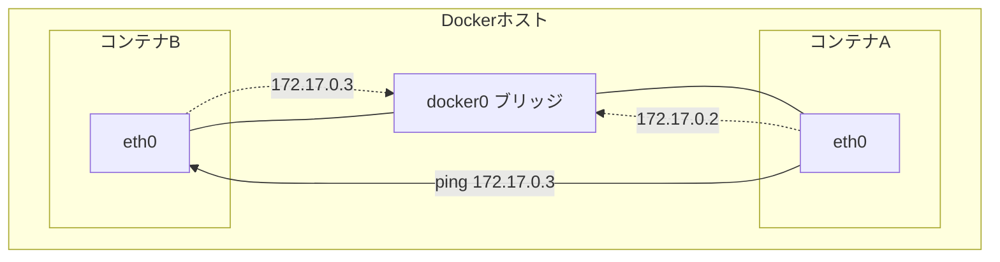
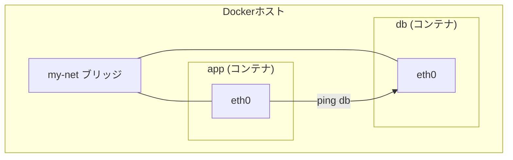
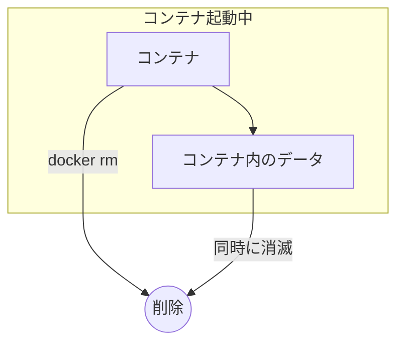
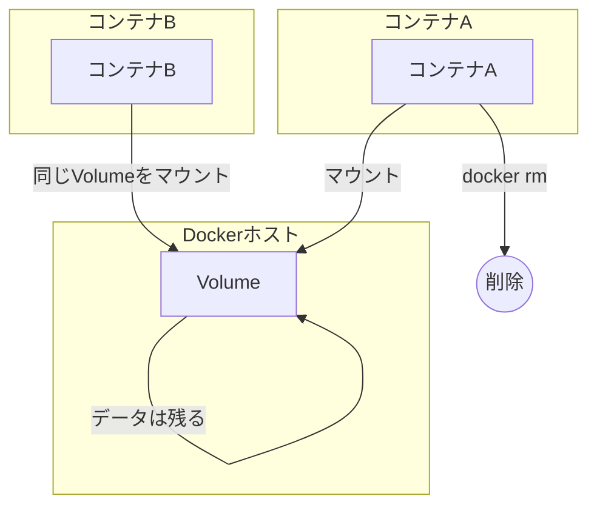

# 第3章: コンテナネットワークとストレージ

### 学習目標

- Dockerのデフォルトネットワーク（ブリッジ）の仕組みを説明できる。
- コンテナ間の名前解決を利用した通信のために、ユーザー定義ネットワークを作成・利用できる。
- コンテナのデータがなぜ消えるのか（コンテナのライフサイクル）を理解する。
- VolumeとBind Mountの違いを説明し、用途に応じて使い分けられる。
- Volumeを使ってコンテナ間でデータを共有したり、データを永続化したりできる。

---

## 1. 【See】コンテナはどのように通信するのか

複数のコンテナを起動すると、それらはどのようにして互いに通信するのでしょうか。Dockerは、コンテナにネットワーキング機能を提供するための仮想的なネットワークインフラを内部に持っています。

### デフォルトブリッジネットワーク

Dockerをインストールすると、`bridge`という名前のネットワークがデフォルトで作成されます。新しく作成されたコンテナは、特に指定がなければこの`bridge`ネットワークに接続されます。

Dockerホスト上には`docker0`という仮想的なネットワークインターフェースが作成され、これが仮想ルーターのように振る舞います。各コンテナには、このネットワーク内でユニークなIPアドレスが割り当てられます。



<center>図3-1: デフォルトブリッジネットワーク</center>

同じ`bridge`ネットワーク上のコンテナは、互いのIPアドレスを使えば通信できます。しかし、コンテナのIPアドレスは起動時に動的に割り当てられるため、IPアドレスを直接使うのは不安定です。

### ユーザー定義ネットワークと名前解決

この問題を解決するのが**ユーザー定義ネットワーク**です。自分で新しいブリッジネットワークを作成すると、Dockerはそのネットワーク上で**DNSベースの名前解決**を自動で有効にしてくれます。

これにより、コンテナ名（またはサービス名）をホスト名として、安定した通信が可能になります。これは、マイクロサービスアーキテクチャを構築する上で極めて重要な機能です。



<center>図3-2: ユーザー定義ネットワークによる名前解決</center>

## 2. 【Do】コンテナ間通信の実践

実際にユーザー定義ネットワークを作成し、コンテナ名で通信できることを確認しましょう。

1.  **ユーザー定義ネットワークの作成**

    ```bash
    $ docker network create my-app-net
    ```

2.  **ネットワーク上にコンテナを起動**

    まず、`db`という名前でRedisコンテナをバックグラウンドで起動します。

    ```bash
    $ docker run -d --name db --network my-app-net redis:alpine
    ```

3.  **名前解決の確認**

    次に、同じネットワーク上にもう一つコンテナを起動し、`db`という名前で`ping`を打ってみます。

    ```bash
    $ docker run --rm --network my-app-net busybox ping db

    PING db (172.19.0.2): 56 data bytes
    64 bytes from 172.19.0.2: seq=0 ttl=64 time=0.081 ms
    64 bytes from 172.19.0.2: seq=1 ttl=64 time=0.128 ms
    ...
    ```

    `db`という名前から、RedisコンテナのIPアドレス（例: `172.19.0.2`）が解決され、通信できていることがわかります。最後に、起動した`db`コンテナを停止・削除しておきましょう。

    ```bash
    $ docker stop db
    $ docker rm db
    ```

## 3. 【See】コンテナのデータはどこへ消える？

コンテナは**揮発性（ephemeral）**です。コンテナを停止し、削除（`docker rm`）すると、コンテナ内で行われた変更はすべて失われます。これは、コンテナのファイルシステムがコンテナ自身のライフサイクルに強く結びついているためです。



<center>図3-3: コンテナを削除するとデータも消える</center>

アプリケーションのログ、ユーザーがアップロードしたファイル、データベースのデータなど、永続化が必要なデータを扱うには、コンテナの外部にデータを保存する仕組みが必要です。そのための仕組みが**Volume**と**Bind Mount**です。

### Volume

**Volume**は、Dockerによって管理される、ホストマシン上の特定の領域です。コンテナを削除してもVolumeは残り続けます。新しいコンテナを起動する際に同じVolumeを接続（マウント）すれば、データを引き継ぐことができます。



<center>図3-4: Volumeによるデータの永続化</center>

### Bind Mount

**Bind Mount**は、ホストマシン上の任意のファイルやディレクトリを、コンテナ内の指定したパスに直接マウントする仕組みです。Volumeと違い、Dockerの管理外の領域を扱います。主に、開発時にホスト上のソースコードをコンテナに反映させるために使われます。

| 特徴     | Volume                     | Bind Mount                     |
| :------- | :------------------------- | :----------------------------- |
| 管理     | Dockerが管理               | ユーザー（ホストOS）が管理     |
| 場所     | Dockerが管理する領域       | ホスト上の任意のパス           |
| 主な用途 | データの永続化（本番環境） | ソースコードの同期（開発環境） |

## 4. 【Do】データの永続化と共有の実践

### Volumeによる永続化

1.  **名前付きVolumeの作成**

    ```bash
    $ docker volume create my-important-data
    ```

2.  **Volumeをマウントしてデータを書き込む**

    作成したVolumeをコンテナの`/data`ディレクトリにマウントし、ファイルを書き込みます。

    ```bash
    $ docker run --rm -v my-important-data:/data busybox sh -c "echo 'This is a very important message.' > /data/message.txt"
    ```

    `-v`フラグの書式は `<ボリューム名>:<コンテナ内のパス>` です。

3.  **別のコンテナからデータを読み込む**

    コンテナは先ほど削除されましたが、Volumeは残っています。別のコンテナを起動し、同じVolumeをマウントして中身を確認します。

    ```bash
    $ docker run --rm -v my-important-data:/data busybox cat /data/message.txt

    This is a very important message.
    ```

    データが正しく永続化されていることが確認できました。

### Bind Mountによる開発効率化

次に、第2章で作成した`nodejs-hello`アプリケーションでBind Mountを試してみましょう。ホストのソースコードをコンテナにマウントすることで、コンテナを再ビルドすることなくコードの変更を反映させます。

```bash
# professional-kubernetes-hands-on/src/apps/nodejs-hello ディレクトリに移動
$ cd professional-kubernetes-hands-on/src/apps/nodejs-hello

# Bind Mountを使ってコンテナを起動
# $(pwd) はカレントディレクトリの絶対パスに展開される
$ docker run -p 3000:3000 --rm -v $(pwd):/app --name dev-app nodejs-hello:1.0
```

コンテナが起動したら、ホストマシン上のエディタで`index.js`のメッセージを書き換えてみましょう。

```javascript
// 変更前
res.send(`<h1>Hello from our Node.js application!</h1>...`);

// 変更後
res.send(`<h1>Code changed without rebuilding!</h1>...`);
```

ファイルを保存した後、コンテナを`docker stop dev-app`で一度停止し、再度同じ`docker run`コマンドで起動してブラウザをリロードしてください。（`nodemon`のようなツールを使えば自動で再起動できます）。イメージを再ビルドしていないにもかかわらず、ブラウザの表示が変更されているはずです。これがBind Mountの力です。

## 5. まとめ

- Dockerコンテナは、デフォルトでは`bridge`ネットワークに接続され、IPアドレスで通信する。
- **ユーザー定義ネットワーク**を作成すると、コンテナ名でのDNS名前解決が有効になり、安定したサービス間通信が可能になる。
- コンテナは揮発性であり、削除すると内部のデータは失われる。
- **Volume**はDockerが管理するストレージで、データの永続化に利用される（本番向け）。
- **Bind Mount**はホストのパスを直接マウントする仕組みで、主に開発時のソースコード同期に利用される（開発向け）。

## 6. 【Check】理解度チェック

1.  `webapp`と`database`という2つのコンテナを起動します。`webapp`から`database`というホスト名で接続できるようにしたいです。この名前解決を有効にするためのベストプラクティスは何ですか？実現するためのコマンドも併せて答えてください。
2.  あなたはコンテナ内でWebアプリケーションを開発しています。ホストの使い慣れたエディタでソースコードを編集し、その変更を即座にコンテナ内で動いているアプリケーションに反映させたいです。この目的のためには、`Volume`と`Bind Mount`のどちらを使いますか？その理由も説明してください。
3.  あなたのアプリケーションは、ユーザーがアップロードした画像を保存します。この画像データは、アプリケーションのバージョンアップ（コンテナの再作成）があっても、決して失われてはなりません。この本番環境の要件を満たすためには、`Volume`と`Bind Mount`のどちらを使うのが一般的ですか？その理由も説明してください。
