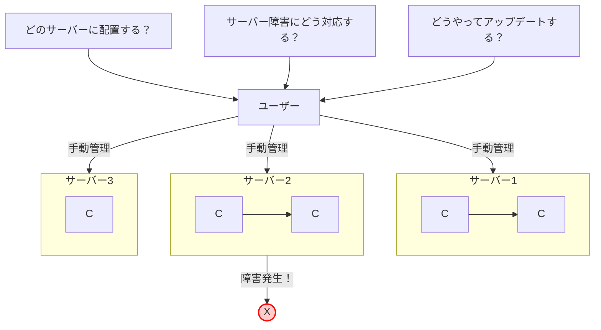

# 第4章: なぜオーケストレーションが必要か

### 学習目標

- 単一ホストでのコンテナ運用の限界を説明できる。
- コンテナオーケストレーションの役割（スケジューリング、自己修復、スケーリング）を理解する。
- Docker Swarmを例に、オーケストレーションの基本的な概念をハンズオンで体験する。
- Docker Swarmの限界を理解し、Kubernetesの必要性を説明できる。

---

## 1. 【See】コンテナが増え、サーバーが増えた世界

第1部では、単一のDockerホスト上でコンテナを扱う方法を学びました。これは開発環境や小規模なアプリケーションでは非常に有効です。しかし、アプリケーションが成長し、トラフィックが増加するとどうなるでしょうか？

- **スケールアウトの課題:** 1台のサーバーでは性能が足りなくなり、複数のサーバー（ホスト）にコンテナを分散配置（スケールアウト）する必要が出てきます。どのサーバーにどのコンテナを配置しますか？負荷を均等にするには？
- **高可用性の課題:** もしコンテナが動いているサーバーが故障したら？アプリケーション全体が停止してしまいます。誰がそれを検知し、別のサーバーでコンテナを再起動しますか？
- **運用の課題:** 数十、数百のコンテナを手動で `docker run` や `docker-compose` を使って管理するのは、現実的ではありません。アプリケーションのアップデートはどう行いますか？



<center>図4-1: 複数ホストを手動で管理する際の課題</center>

これらの課題を解決するのが、**コンテナオーケストレーション**です。

## 2. 【See】オーケストレーション: コンテナの指揮者

オーケストレーションとは、多数のコンテナのデプロイ、管理、スケーリング、ネットワーキングなどを自動化するための仕組みです。まるでオーケストラの指揮者（コンダクター）のように、多数のコンテナ（楽器）が協調して一つのアプリケーション（楽曲）として正しく動作するように指揮をします。

主な役割は以下の通りです。

- **スケジューリング:** どのコンテナを、どのサーバー（ノード）で実行するかを自動で決定します。
- **自己修復 (Self-healing):** コンテナやノードに障害が発生した場合、それを自動で検知し、別の正常なノードでコンテナを再起動して、望ましい状態を維持します。
- **スケーリング:** アプリケーションの負荷に応じて、コンテナの数を自動で増減させます。
- **サービスディスカバリとロードバランシング:** 複数のコンテナにトラフィックを分散し、サービス間の通信を容易にします。

### 入門編: Docker Swarm

Kubernetesを学ぶ前に、よりシンプルなオーケストレーションツールである**Docker Swarm**に触れてみましょう。SwarmはDockerに統合されており、Dockerの知識を活かしてオーケストレーションの基本を体験できます。

Swarmは、複数のDockerホストを束ねて一つの**クラスタ**を形成します。クラスタは、管理を担当する**マネージャーノード**と、実際にコンテナを実行する**ワーカーノード**で構成されます。

```mermaid
graph TD
    subgraph "Swarm クラスタ"
        direction LR
        M[マネージャー] -- "指示" --> W1[ワーカー1]
        M -- "指示" --> W2[ワーカー2]

        subgraph W1
            C1[Task(コンテナ)]
            C2[Task(コンテナ)]
        end
        subgraph W2
            C3[Task(コンテナ)]
        end
    end

    U[ユーザー] -- "docker service create..." --> M
```

<center>図4-2: Docker Swarmのアーキテクチャ</center>

ユーザーはマネージャーノードに「こういうサービス（例: Nginxコンテナを3つ）を実行したい」という**宣言**を行うと、マネージャーがその宣言通りになるように、ワーカーノードにコンテナ（Swarmでは**タスク**と呼びます）の起動を指示します。

## 3. 【Do】Swarmによる自己修復とスケーリングの体験

実際にSwarmを動かし、オーケストレーションの力を体験してみましょう。ここでは、あなたのPC1台だけで擬似的なクラスタを構成します。

1.  **Swarmモードの初期化**

    以下のコマンドで、あなたのDockerエンジンがSwarmのマネージャーになります。

    ```bash
    $ docker swarm init
    ```

2.  **サービスの作成**

    `docker run` の代わりに `docker service create` を使います。Nginxコンテナを3つ（`--replicas 3`）持つサービスを作成してみましょう。

    ```bash
    $ docker service create --name my-web --replicas 3 -p 8080:80 nginx
    ```

3.  **サービスの状態確認**

    `docker service ls` でサービスの一覧を、`docker service ps <サービス名>` でサービスを構成するタスク（コンテナ）の詳細を確認できます。

    ```bash
    $ docker service ps my-web
    ID             NAME          IMAGE          NODE      DESIRED STATE   CURRENT STATE
    2z...          my-web.1      nginx:latest   moby      Running         Running 15 seconds ago
    0a...          my-web.2      nginx:latest   moby      Running         Running 15 seconds ago
    vz...          my-web.3      nginx:latest   moby      Running         Running 15 seconds ago
    ```

    3つのコンテナが起動していることがわかります。

4.  **自己修復の確認（Aha!モーメント）**

    ここで、意図的にコンテナを1つ削除してみます。`docker ps`で`my-web`のコンテナIDを一つ探し、`docker rm -f`で強制的に削除してください。

    ```bash
    $ docker ps
    # my-webのコンテナIDの一つをコピー (例: 5d8e355a7331)

    $ docker rm -f 5d8e355a7331
    ```

    コンテナが削除された直後、もう一度 `docker service ps my-web` を実行してみてください。

    ```bash
    $ docker service ps my-web
    ID             NAME          IMAGE          NODE      DESIRED STATE   CURRENT STATE
    2z...          my-web.1      nginx:latest   moby      Running         Running 5 minutes ago
    ...            my-web.2      nginx:latest   moby      Shutdown        Failed 3 seconds ago
    vz...          my-web.3      nginx:latest   moby      Running         Running 5 minutes ago
    x9...          my-web.2      nginx:latest   moby      Running         Running 2 seconds ago
    ```

    驚いたことに、古いコンテナが`Shutdown`状態になり、すぐに新しいコンテナが起動して、**レプリカ数が3つに保たれている**のがわかります。これがオーケストレーションによる**自己修復**です。

5.  **スケーリングの確認**

    次に、サービスのコンテナ数を5つに増やしてみましょう。

    ```bash
    $ docker service scale my-web=5
    ```

    再度 `docker service ps my-web` を実行すると、コンテナが5つに増えていることが確認できます。これが**スケーリング**です。

6.  **クリーンアップ**

    最後に、サービスを削除し、Swarmモードを終了します。

    ```bash
    $ docker service rm my-web
    $ docker swarm leave --force
    ```

## 4. 【See】Swarmの限界とKubernetesの登場

Docker Swarmはオーケストレーションの基本を学ぶのに最適ですが、なぜ世界の主流はKubernetesになったのでしょうか。Swarmには、より複雑な本番環境の要求に応える上でのいくつかの限界がありました。

- **柔軟性と拡張性:** Swarmの機能はDockerに組み込まれておりシンプルですが、Kubernetesほど柔軟ではなく、APIの拡張性も低いです。Kubernetesは、カスタムリソース（CRD）によって機能を無限に拡張できます。
- **宣言的モデルの徹底:** Kubernetesは、システムの状態をYAMLファイルで厳密に定義する「宣言的モデル」をSwarm以上に徹底しています。これにより、GitOpsのような高度な運用が可能になります。
- **エコシステム:** Kubernetesは業界標準としての地位を確立し、監視、ロギング、セキュリティなど、周辺ツールやサービス（エコシステム）が非常に豊富です。
- **より高度な概念:** Kubernetesには、Pod、Service、Ingress、StatefulSetなど、Swarmにはない、より高度で柔軟なアプリケーション管理のための概念が多数存在します。

Swarmが「自家用車」だとすれば、Kubernetesは「大型輸送トラック」です。より多くの荷物（＝本番環境の複雑な要求）を、より柔軟かつ確実に運ぶ能力に長けています。次の章から、いよいよこのKubernetesの世界に飛び込んでいきます。

## 5. まとめ

- アプリケーションが大規模になると、複数ホストにまたがるコンテナの管理（スケジューリング、自己修復、スケーリング）が課題となる。
- コンテナオーケストレーションは、これらの課題を自動化する「指揮者」の役割を果たす。
- Docker Swarmは、Dockerに統合されたシンプルなオーケストレーションツールであり、自己修復やスケーリングの基本を体験できる。
- Swarmはシンプルさが利点だが、より複雑な本番要件に応えるための柔軟性、拡張性、エコシステムの面で、Kubernetesに軍配が上がった。

## 6. 【Check】理解度チェック

1.  あなたはWebアプリケーションを1つのコンテナで運用しています。もしそのコンテナが動いているサーバーが突然クラッシュした場合、アプリケーションはどうなりますか？Docker Swarmのようなオーケストレーターは、この「高可用性」の問題をどのように解決しますか？
2.  あなたのWebサイトへのアクセスが急増し、現在3つで動いているコンテナを10個に増やす必要が出てきました。もし`docker run`で手動管理していた場合、どのような作業が必要になりますか？`docker service scale`コマンドは、このプロセスをどのように簡略化しますか？
3.  ハンズオンの演習を踏まえて、`docker run`と`docker service create`の根本的な違いは何だと思いますか？「一回限りの命令」と「あるべき姿の宣言」という観点から説明してください。
