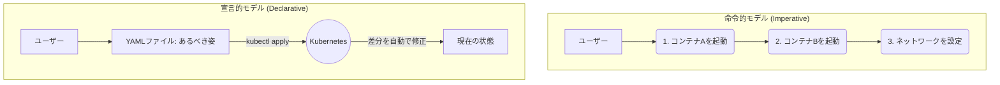
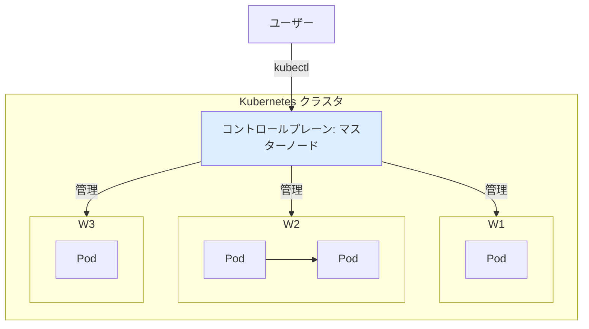
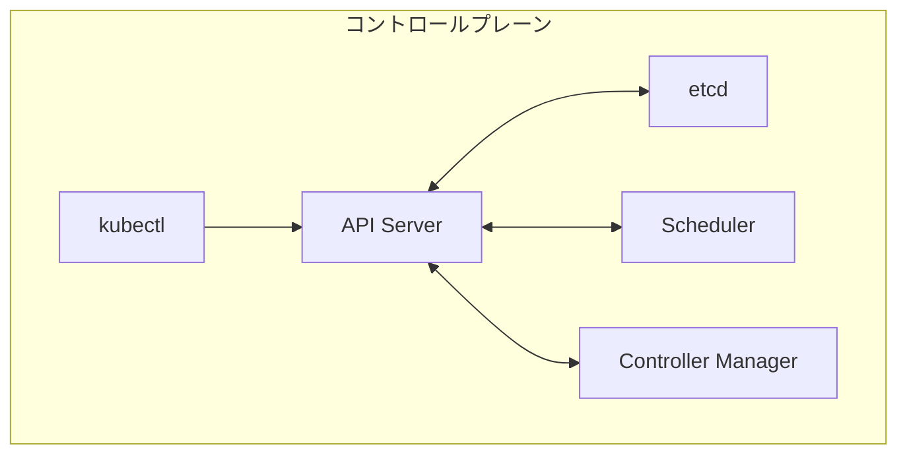
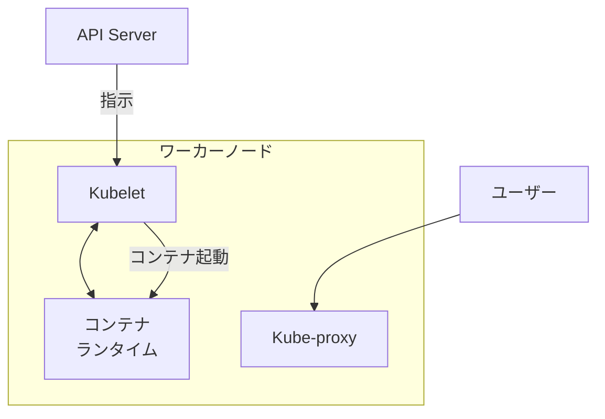

# 第5章: Kubernetesの登場と設計思想

### 学習目標

- Kubernetesの「宣言的モデル」と「命令的モデル」の違いを説明できる。
- Kubernetesの全体アーキテクチャ（コントロールプレーンとワーカーノード）を理解する。
- コントロールプレーンを構成する主要コンポーネント（API Server, etcd, Scheduler, Controller Manager）の役割を説明できる。
- ワーカーノードを構成する主要コンポーネント（Kubelet, Kube-proxy）の役割を説明できる。

---

## 1. 【See】Kubernetesの設計思想: 宣言的モデル

第4章でDocker Swarmの限界に触れました。Kubernetesが今日の地位を築いた理由の一つは、その設計思想の根幹にある**宣言的モデル (Declarative Model)** の徹底にあります。

- **命令的モデル (Imperative Model):** 「何を」「どのように」実行するかを、手順を追って具体的に指示する方式。(`docker run ...`, `docker service scale ...`)
- **宣言的モデル (Declarative Model):** システムが「どうあるべきか」という**最終的な状態**を定義ファイル（YAML）で宣言し、その状態を実現するための具体的な手順はシステム自身に任せる方式。

例えるなら、レストランでシェフに「玉ねぎを切り、肉を炒め、ソースを加え…」と手順を指示するのが命令的モデルです。一方で、「ビーフストロガノフを一つ」と完成形だけを注文するのが宣言的モデルです。シェフ（＝Kubernetes）は、その完成形に至るまでの調理法や、もし途中で塩をこぼしてもリカバリーする方法を知っています。



<center>図5-1: 命令的モデル vs 宣言的モデル</center>

この宣言的モデルにより、Kubernetesは常に「あるべき姿」を維持しようと自律的に動作します。これが、障害からの自動復旧（自己修復）や、複雑なデプロイメントを驚くほどシンプルに実現できる理由です。

## 2. 【See】Kubernetesアーキテクチャの全体像

Kubernetesクラスタは、大きく分けて2種類のノード（サーバー）で構成されます。

- **コントロールプレーン (Control Plane):** クラスタ全体を管理・制御する「頭脳」。マスターノードとも呼ばれます。
- **ワーカーノード (Worker Node):** 実際にアプリケーションコンテナを動かす「筋肉」。単にノードとも呼ばれます。

ユーザーは、`kubectl`というコマンドラインツールを使ってコントロールプレーンの**API Server**と通信し、「あるべき姿」を宣言します。コントロールプレーンは、その宣言に従ってワーカーノードを管理し、コンテナを配置・実行します。



<center>図5-2: Kubernetesのハイレベルアーキテクチャ</center>

## 3. 【See】コントロールプレーンの内部

クラスタの「頭脳」であるコントロールプレーンは、複数のコンポーネントが連携して動作しています。



<center>図5-3: コントロールプレーンの主要コンポーネント</center>

- **API Server (`kube-apiserver`):**
  コントロールプレーンの唯一の窓口。全ての外部との通信（`kubectl`など）と、内部コンポーネント間の通信はここを経由します。ユーザーからの宣言を受け付け、`etcd`に保存する役割も担います。

- **etcd:**
  クラスタの全ての構成情報や状態を保存する、信頼性の高いKey-Valueストア（データベース）。クラスタの「唯一の信頼できる情報源 (Single Source of Truth)」です。

- **Scheduler (`kube-scheduler`):**
  新しく作成されたPod（コンテナの集まり）を、どのワーカーノードで実行するのが最適かを決定する役割を担います。ノードのリソース使用状況や、様々な制約を考慮して配置先を決定します。

- **Controller Manager (`kube-controller-manager`):**
  クラスタの状態を常に監視し、「あるべき姿」（`etcd`に記録されている状態）と「現在の状態」に差があれば、それを修正しようと動作するコントローラー群の集合体です。例えば、「レプリカ数が3であるべき」サービスでコンテナが1つクラッシュしたら、それを検知して新しいコンテナを起動するようSchedulerに依頼するのはこのコンポーネントの役割です。

## 4. 【See】ワーカーノードの内部

アプリケーションを実際に動かすワーカーノードにも、重要なコンポーネントが存在します。



<center>図5-4: ワーカーノードの主要コンポーネント</center>

- **Kubelet:**
  各ワーカーノードに常駐するエージェント。コントロールプレーンのAPI Serverと通信し、自分のノードで実行すべきPodの情報を取得して、コンテナランタイムにコンテナの起動・停止を指示します。また、コンテナが正常に動作しているかを監視する役割も担います。

- **Kube-proxy:**
  各ワーカーノードのネットワークを管理するプロキシ。Podへのネットワークトラフィックを適切なコンテナにルーティングするためのルール（iptablesなど）を管理します。

- **コンテナランタイム (Container Runtime):**
  実際にコンテナを起動・管理するソフトウェア。Dockerが有名ですが、Kubernetesは`containerd`や`CRI-O`など、CRI (Container Runtime Interface) という標準仕様に準拠した様々なランタイムを利用できます。

## 5. 【Do】宣言的モデルをYAMLで読み解く

この章は概念が中心ですが、実際の「宣言」がどのように見えるかを見てみましょう。これは、Webサーバー（Nginx）を3つ起動するための、KubernetesのYAMLファイルの一部です。

```yaml
apiVersion: apps/v1
kind: Deployment
metadata:
  name: nginx-deployment
spec:
  replicas: 3 # <--- ★ここが「あるべき姿」の宣言
  selector:
    matchLabels:
      app: nginx
  template:
    metadata:
      labels:
        app: nginx
    spec:
      containers:
        - name: nginx
          image: nginx:1.14.2
          ports:
            - containerPort: 80
```

**演習:** このYAMLファイルを読んで、以下の問いに答えてみてください。

1. あなたがKubernetesに宣言している「あるべき姿」は、具体的にどのような状態ですか？（ヒント: `replicas`）
2. この「あるべき姿」を維持するために、常にクラスタを監視しているコントロールプレーンのコンポーネントは何ですか？

**答え:**

1. 「Nginxのコンテナが、常に3つ起動している状態」
2. Controller Manager

## 6. まとめ

- Kubernetesは、手順ではなく「あるべき姿」を宣言する**宣言的モデル**を採用している。
- クラスタは、管理を担当する**コントロールプレーン**と、コンテナを実行する**ワーカーノード**で構成される。
- コントロールプレーンには、窓口である**API Server**、データベースである**etcd**、配置を決める**Scheduler**、状態を維持する**Controller Manager**が存在する。
- 各ワーカーノードには、エージェントである**Kubelet**と、ネットワークを管理する**Kube-proxy**が常駐している。
- これら全てのコンポーネントが協調し、ユーザーが宣言した「あるべき姿」を自律的に維持し続けるのがKubernetesの仕組みの核心である。

## 7. 【Check】理解度チェック

1.  あなたが「Webアプリのコンテナを5つ起動せよ」というYAMLファイルを`kubectl`で適用した直後、ワーカーノードの1台が故障し、その上で動いていたコンテナが1つ停止しました。この一連の出来事の中で、Controller ManagerとSchedulerはそれぞれどのような役割を果たしますか？
2.  Kubernetesクラスタ全体の「あるべき姿」を記録している、唯一の信頼できる情報源（Single Source of Truth）となるコンポーネントは何ですか？
3.  ピザを注文する状況を例にとって、「命令的モデル」と「宣言的モデル」の違いを説明してください。
