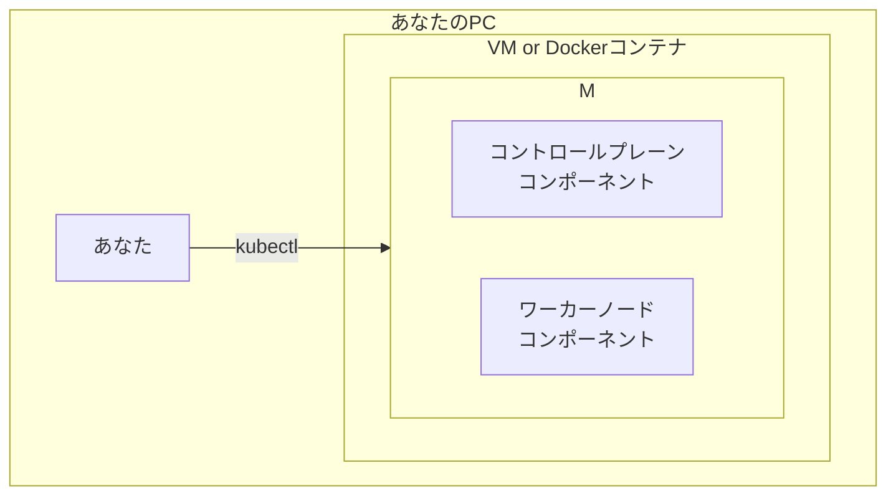

# 第6章: Kubernetes環境構築

### 学習目標

- ローカルマシンにMinikubeを使ってKubernetesクラスタを構築できる。
- `kubectl`の基本的なコマンド（`get`, `describe`, `apply`, `delete`, `logs`, `exec`）を使いこなせる。
- 命令的な方法と宣言的な方法の両方でPodをデプロイできる。
- Kubernetesダッシュボードを使って、クラスタの状態を視覚的に確認できる。

---

## 1. 【See】ローカル開発環境のセットアップ

Kubernetesを学ぶ最良の方法は、実際に触ってみることです。しかし、本番用のクラスタをいきなり使うのは現実的ではありません。そこで、自分のPC上で手軽にKubernetesクラスタを動かせる**Minikube**というツールを使います。

Minikubeは、VM（仮想マシン）やDockerコンテナの中に、コントロールプレーンとワーカーノードの機能が一緒になった、コンパクトな単一ノードのKubernetesクラスタを構築します。学習や開発目的には最適です。



<center>図6-1: Minikubeのアーキテクチャ</center>

クラスタとの対話には、**`kubectl`**（キューブコントロールと読む）というコマンドラインツールを使います。`kubectl`は、クラスタのAPI Serverと通信し、リソースの作成・参照・更新・削除など、あらゆる操作を行うための標準的なツールです。

## 2. 【Do】Minikubeとkubectlのインストール

### Step 1: ツールのインストール

Minikubeとkubectlは、お使いのOSに応じてインストールする必要があります。公式サイトの手順に従うのが最も確実です。

- **Minikubeのインストール:** [Minikube 公式インストールガイド](https://minikube.sigs.k8s.io/docs/start/)
- **kubectlのインストール:** [kubectl 公式インストールガイド](https://kubernetes.io/docs/tasks/tools/install-kubectl/)

> **注意:** Minikubeは内部でコンテナまたはVMを動かすため、事前にDocker DesktopやVirtualBoxなどのドライバーをインストールしておく必要があります。本書ではDocker Desktopの利用を推奨します。

### Step 2: Minikubeクラスタの起動

インストールが完了したら、以下のコマンドでKubernetesクラスタを起動します。

```bash
# Dockerをドライバーとして指定してMinikubeを起動
$ minikube start --driver=docker

# ☕ Dockerイメージのダウンロードなどで、初回は数分かかります
```

### Step 3: クラスタの状態確認

クラスタが正常に起動したか確認しましょう。

```bash
# Minikubeの状態を確認
$ minikube status

# kubectlがクラスタと通信できるか確認
$ kubectl cluster-info

# クラスタを構成するノードを確認
$ kubectl get nodes
NAME       STATUS   ROLES           AGE   VERSION
minikube   Ready    control-plane   2m    v1.28.3
```

`kubectl get nodes`で`minikube`ノードが`Ready`状態になっていれば、セットアップは成功です。

## 3. 【Do】kubectl基本コマンドマスター

`kubectl`は非常に多機能ですが、基本形は `kubectl <コマンド> <リソースタイプ> <リソース名>` です。まずは最もよく使うコマンドを体験しましょう。

### Podの作成（命令的）

`kubectl run`コマンドを使うと、YAMLファイルなしで素早くリソースを作成できます。（注: 古いバージョンとは異なり、現在の`kubectl run`はPodを直接作成します）

```bash
# Nginxのイメージを使ってPodを作成
$ kubectl run first-pod --image=nginx

# Podの一覧を取得
$ kubectl get pods
NAME        READY   STATUS    RESTARTS   AGE
first-pod   1/1     Running   0          10s
```

### リソースの詳細確認 (`describe`)

Podがなぜか起動しない、といった問題の調査に非常に役立つのが`describe`です。リソースの詳細な情報や、関連するイベントログを表示します。

```bash
$ kubectl describe pod first-pod

# ...多くの情報が表示される...
Events:
  Type    Reason     Age   From               Message
  ----    ------     ----  ----               -------
  Normal  Scheduled  58s   default-scheduler  Successfully assigned default/first-pod to minikube
  Normal  Pulling    57s   kubelet            Pulling image "nginx"
  Normal  Pulled     55s   kubelet            Successfully pulled image "nginx" in 2.0s
  Normal  Created    55s   kubelet            Created container nginx
  Normal  Started    55s   kubelet            Started container nginx
```

### ログの確認 (`logs`)

コンテナが出力する標準出力を確認します。

```bash
# -f を付けると、ログをリアルタイムで追尾できる (tail -f と同じ)
$ kubectl logs -f first-pod
```

### コンテナ内でのコマンド実行 (`exec`)

起動中のコンテナの中に入って、デバッグなどのためにコマンドを実行できます。

```bash
# first-podコンテナの中で、インタラクティブなbashシェルを起動
$ kubectl exec -it first-pod -- /bin/bash

# コンテナ内で実行
root@first-pod:/# ls
root@first-pod:/# exit
```

### リソースの削除 (`delete`)

作成したPodを削除します。

```bash
$ kubectl delete pod first-pod
pod "first-pod" deleted
```

## 4. 【Do】宣言的モデルによるPodの作成

`kubectl run`は手軽ですが、本番環境では「何をデプロイしたか」をファイルとして管理できる宣言的な方法が推奨されます。`src/part3/pod.yaml`を使ってPodを作成してみましょう。

```bash
# YAMLファイルを指定してリソースを作成・更新
$ kubectl apply -f professional-kubernetes-hands-on/src/part3/pod.yaml
pod/nginx-pod-declarative created

# Podが作成されたことを確認
$ kubectl get pods
NAME                      READY   STATUS    RESTARTS   AGE
nginx-pod-declarative   1/1     Running   0          5s
```

`apply`コマンドは、ファイルが存在しなければ作成し、既に存在すれば変更箇所だけを適用する、非常に便利なコマンドです。ファイルの削除も`-f`オプションで行えます。

```bash
$ kubectl delete -f professional-kubernetes-hands-on/src/part3/pod.yaml
pod "nginx-pod-declarative" deleted
```

## 5. 【Do】Kubernetesダッシュボードの活用

CUIだけでなく、WebベースのUIでクラスタを管理することもできます。

```bash
$ minikube dashboard
```

このコマンドを実行すると、自動でブラウザが開き、Kubernetesダッシュボードが表示されます。Podの一覧、CPUやメモリの使用状況などを視覚的に確認できます。どのような情報が見えるか、一通りクリックして探検してみましょう。

## 6. まとめ

- Minikubeを使うことで、ローカルPC上に手軽に学習用Kubernetesクラスタを構築できる。
- `kubectl`はKubernetesを操作するための必須ツールであり、`get`, `describe`, `apply`, `delete`などが基本となる。
- `kubectl run`は手軽な命令的コマンドだが、再現性・管理性の観点から、本番運用ではYAMLファイルを使った`kubectl apply`（宣言的コマンド）が推奨される。
- `minikube dashboard`を使えば、Web UIからクラスタの状態を視覚的に把握できる。

## 7. 【Check】理解度チェック

1.  現在クラスタで実行中の全てのPodを、IPアドレスや稼働しているノード名などの追加情報付きで一覧表示したいです。この場合、どのような`kubectl`コマンドを実行しますか？
2.  `my-app-pod`という名前のPodが`Pending`状態のまま起動しません。原因を調査するために、まず最初に試すべき`kubectl`コマンドは何ですか？そのコマンドでどのような情報が得られますか？
3.  `kubectl run`でPodを作成する方法と、`kubectl apply -f my-pod.yaml`でPodを作成する方法の最も大きな違いは何ですか？本番環境のアプリケーションを管理する上で、どちらのアプローチが推奨されますか？その理由も説明してください。
