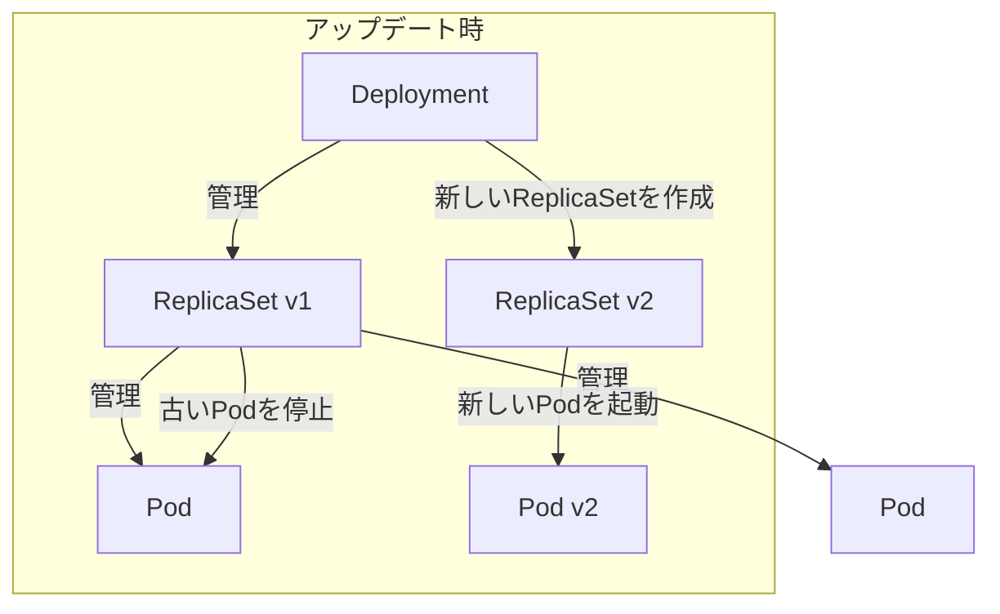
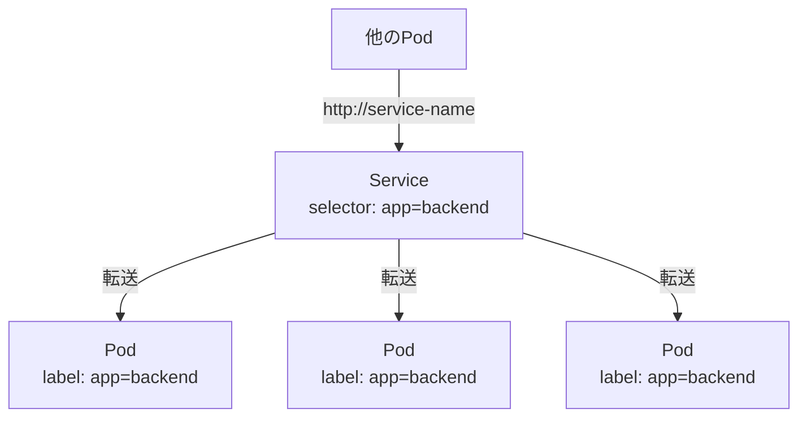

# 第7章: 基本リソースの理解と実践

### 学習目標

- Pod, Deployment, Serviceの役割と関係性を説明できる。
- ラベルとセレクターを使って、リソースを柔軟にグループ化できる。
- Deploymentを使い、アプリケーションのローリングアップデートを実行できる。
- Serviceの3つの主要なタイプ（ClusterIP, NodePort, LoadBalancer）を理解し、使い分けられる。
- ConfigMapとSecretを使って、アプリケーションの構成情報をコンテナイメージから分離できる。
- 複数のリソースを組み合わせて、マイクロサービスアプリケーションをKubernetes上にデプロイできる。

---

Kubernetesの強力さは、機能ごとに責務が分離された、再利用可能な「リソース」という部品を組み合わせる点にあります。この章では、最も基本的で重要なビルディングブロックであるPod, Deployment, Serviceを学び、それらを使って実際にアプリケーションを動かしてみましょう。

## 1. 【See】Pod: コンテナを入れる鞘

第5章で学んだように、**Pod**はKubernetesにおけるデプロイの最小単位です。Podは1つまたは複数のコンテナを内包する「鞘（さや）」のようなものです。

なぜコンテナを直接デプロイしないのでしょうか？Pod内のコンテナは、**ネットワーク空間とストレージボリュームを共有できる**からです。これにより、あたかも同じマシン上で動いているかのように、`localhost`を通じて通信したり、ファイルを共有したりできます。これは、メインのアプリケーションコンテナと、そのログを収集する補助的なコンテナ（サイドカー）を一つのPodにまとめる、といった高度なパターンで役立ちます。

しかし、ほとんどの場合、**1つのPodには1つのコンテナだけ**を配置するのがベストプラクティスです。

## 2. 【See】Deployment: Podの管理者

Podは揮発性であり、もしPodが動いているノードが故障すれば、Podは失われてしまいます。また、アプリケーションをスケールさせるためにPodを3つに増やしたい場合、手動で3つのPod定義を書くのは非効率です。

この問題を解決するのが**Deployment**です。Deploymentは、指定した数のPod（レプリカ）が常に実行されている状態を維持することを責務とします。

- **自己修復:** あるPodが停止した場合、Deploymentはそれを検知し、自動的に新しいPodを起動して、指定されたレプリカ数を維持します。
- **スケーリング:** `replicas`の数を変更して`kubectl apply`するだけで、簡単にPodの数を増減できます。
- **ローリングアップデート:** アプリケーションの新しいバージョンをデプロイする際、古いPodを一度にすべて停止させるのではなく、新しいPodを一つ起動し、古いPodを一つ停止する、というプロセスを繰り返すことで、ダウンタイムなしのアップデートを実現します。

実際には、Deploymentは**ReplicaSet**という別のリソースを介してPodを管理します。ローリングアップデートの際には、新しいReplicaSetを作成し、徐々に新しい方へPodを移行させます。



<center>図7-1: DeploymentとReplicaSetの関係</center>

## 3. 【See】Service: Podへの安定した窓口

DeploymentのおかげでPodの数は変動し、Pod自身もいつ再作成されるかわからない（IPアドレスも変わる）存在になりました。では、どうやってこれらのPodに安定してアクセスすればよいのでしょうか？

その答えが**Service**です。Serviceは、複数のPodに対する単一の安定したアクセスポイント（IPアドレスとDNS名）を提供し、それらのPodへのトラフィックを負荷分散（ロードバランス）します。

ServiceがどのPodにトラフィックを転送するかは、**ラベル (Label)** と **セレクター (Selector)** という仕組みで決まります。Podに`app: my-webapp`のようなキーバリューペアのラベルを付け、Serviceのセレクターに同じラベルを指定することで、両者が動的に紐付けられます。



<center>図7-2: Serviceとラベル・セレクター</center>

Serviceには主に3つのタイプがあります。

- **ClusterIP:** (デフォルト) クラスタ内部でのみアクセス可能な仮想IPを割り当てます。サービス間通信で使われます。
- **NodePort:** 各ワーカーノードの特定のポートでサービスを公開します。`http://<ノードのIP>:<NodePort>` のように、クラスタ外部からアクセスできます。開発やテストで便利です。
- **LoadBalancer:** クラウドプロバイダー（AWS, GCPなど）が提供するロードバランサーをプロビジョニングし、サービスを外部に公開します。本番環境で外部にサービスを公開する際の標準的な方法です。

## 4. 【See】ConfigMap & Secret: 構成情報の分離

アプリケーションの接続情報や設定値を、コンテナイメージに直接書き込む（ハードコードする）のは悪い習慣です。環境ごとに設定を変えたい場合に、イメージを再ビルドする必要があるからです。

- **ConfigMap:** 一般的な構成情報をキーバリュー形式で保存します。
- **Secret:** パスワードやAPIキーなどの機密情報を保存します。データはBase64でエンコードされますが、暗号化されているわけではない点に注意が必要です（あくまで機密情報であるという「印」です）。

これらのリソースは、環境変数として、あるいはファイルとしてPodにマウントして、アプリケーションに渡すことができます。

## 5. 【Do】マイクロサービスアプリケーションのデプロイ

それでは、これまでに学んだリソースを総動員して、Node.jsアプリとRedisデータベースから成るマイクロサービスをデプロイしましょう。`src/part3/microservice-app/`に用意したYAMLファイル群を使います。

### Step 1: MinikubeのDocker環境を利用する

今回のハンズオンでは、第2章でビルドした`nodejs-hello:1.0`というローカルイメージを使います。しかし、Minikubeは自身の内部にあるDocker環境を使うため、ホストPCのDockerイメージを直接見ることはできません。以下のコマンドを実行して、ホストPCのDockerコマンドがMinikubeのDockerデーモンを指すようにします。

```bash
# macOS / Linux
$ eval $(minikube -p minikube docker-env)

# Windows (PowerShell)
# & minikube -p minikube docker-env | Invoke-Expression
```

この設定はターミナルのセッション内でのみ有効です。この後、`nodejs-hello`アプリのディレクトリで`docker build`を再実行し、Minikube環境内にイメージを作成しておきましょう。

```bash
$ cd professional-kubernetes-hands-on/src/apps/nodejs-hello
$ docker build -t nodejs-hello:1.0 .
```

### Step 2: 全てのYAMLを適用する

`src/part3/microservice-app`ディレクトリに移動し、`kubectl apply`コマンドで全てのYAMLファイルを一度に適用します。

```bash
$ cd professional-kubernetes-hands-on/src/part3/microservice-app
$ kubectl apply -f .

secret/redis-secret created
deployment.apps/redis-deployment created
service/redis-service created
configmap/node-app-configmap created
deployment.apps/node-app-deployment created
service/node-app-service created
```

### Step 3: 状態を確認する

`kubectl get`コマンドで、作成されたリソースをまとめて確認しましょう。

```bash
$ kubectl get deployments,pods,services

NAME                               READY   UP-TO-DATE   AVAILABLE   AGE
deployment.apps/node-app-deployment   2/2     2            2           60s
deployment.apps/redis-deployment    1/1     1            1           60s

NAME                                      READY   STATUS    RESTARTS   AGE
pod/node-app-deployment-xxxx-yyyy   1/1     Running   0          60s
pod/node-app-deployment-xxxx-zzzz   1/1     Running   0          60s
pod/redis-deployment-aaaa-bbbb      1/1     Running   0          60s

NAME                       TYPE        CLUSTER-IP      EXTERNAL-IP   PORT(S)          AGE
service/kubernetes         ClusterIP   10.96.0.1       <none>        443/TCP          20m
service/node-app-service   NodePort    10.108.144.28   <none>        3000:30080/TCP   60s
service/redis-service      ClusterIP   10.103.13.12    <none>        6379/TCP         60s
```

Deployment、Pod、Serviceがすべて正常に起動していることが確認できます。

### Step 4: アプリケーションにアクセスする

`node-app-service`は`NodePort`タイプなので、Minikubeが提供する便利なコマンドでアクセスできます。

```bash
$ minikube service node-app-service

# ブラウザが自動で開き、アプリケーションが表示される
```

ブラウザに「Hello from our Node.js application!」と表示されれば、デプロイは成功です！

## 6. まとめ

- Podはコンテナのラッパーであり、Deploymentによってその数やバージョンが管理される。
- Serviceは、流動的なPod群に対して安定したアクセスポイントを提供する。
- ラベルとセレクターは、ServiceとPodを疎結合に結びつけるための重要な仕組みである。
- ConfigMapとSecretは、構成情報をイメージから分離し、アプリケーションのポータビリティを高める。
- これらの基本リソースを組み合わせることで、スケーラブルで回復力のあるアプリケーションをKubernetes上に構築できる。

## 7. 【Check】理解度チェック

1.  あるDeploymentによって管理されているPodが3つあります。そのうちの1つを手動で`kubectl delete pod ...`コマンドで削除した場合、その後どうなりますか？なぜそうなりますか？
2.  `webapp`という名前のPodから`database`という名前のPodに接続したいです。PodのIPアドレスを直接使うべきですか？もし違うなら、どのようなリソースを作成して安定した通信を実現しますか？その仕組みも簡単に説明してください。
3.  アプリケーションが使うデータベースのパスワードをPodに渡す必要があります。ConfigMapとSecretのどちらを使うべきですか？その理由も説明してください。
