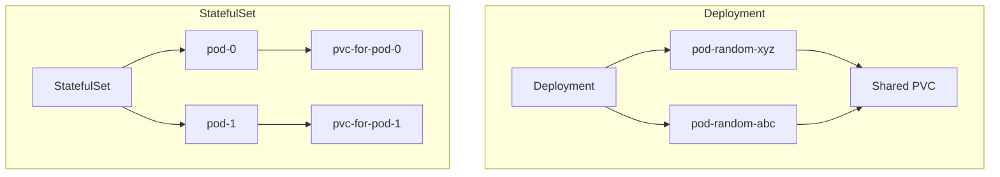

# 第8章: 永続化とステートフル管理

### 学習目標

- なぜステートフルアプリケーションの管理が難しいかを説明できる。
- PersistentVolume (PV) と PersistentVolumeClaim (PVC) の役割分担を理解する。
- StorageClass を使った動的なストレージプロビジョニングの仕組みを説明できる。
- Deployment と StatefulSet の違いを理解し、StatefulSet が提供する3つの保証（安定したID、安定したストレージ、順序性）を説明できる。
- StatefulSet を使って、データベースなどのステートフルアプリケーションをデプロイできる。

---

これまでの章では、主にステートレスなアプリケーションを扱ってきました。Podがいつ削除・再作成されても問題ない、という前提です。しかし、データベースのように「状態（データ）」を永続的に保持する必要があるアプリケーションはどうでしょうか。この章では、Kubernetesでステートフルアプリケーションを管理するための重要なリソースを学びます。

## 1. 【See】ストレージ管理の抽象化

Podの定義内で特定のホストのディレクトリをマウントする`hostPath`のようなボリュームも存在しますが、これはノードに依存するためポータビリティがありません。Podが別のノードで再起動されると、そのデータにはアクセスできなくなります。

この問題を解決するため、Kubernetesはストレージの実体をPodの定義から分離する、**PersistentVolume (PV)** と **PersistentVolumeClaim (PVC)** という2つのリソースを導入しました。

- **PersistentVolume (PV):** 管理者によってプロビジョニングされた、クラスタ内の「物理的な」ストレージの一部。NFS、iSCSI、あるいはクラウドプロバイダーのディスク（GCE Persistent Disk, AWS EBSなど）といった具体的なストレージ技術に紐付いています。これは「利用可能なストレージのプール」と考えることができます。

- **PersistentVolumeClaim (PVC):** ユーザー（またはPod）によるストレージの「要求」。Podは「10GiBのSSDストレージが欲しい」といった要求をPVCとして発行します。具体的なストレージ技術を知る必要はありません。

この仕組みにより、アプリケーション開発者は必要なストレージのスペックだけを要求し、管理者はインフラの物理的なストレージを管理するという、**関心の分離**が実現されます。

```mermaid
graph TD
    subgraph "管理者"
        PV1[PV 5GiB]
        PV2[PV 10GiB]
        PV3[PV 100GiB]
    end

    subgraph "ユーザー"
        Pod --> PVC[PVC<br>"10GiB欲しい"]
    end

    PVC -- "要求に合うPVを探して束縛(Bind)" --> PV2
```

<center>図8-1: PersistentVolume (PV) と PersistentVolumeClaim (PVC)</center>

## 2. 【See】動的プロビジョニングとStorageClass

管理者が手動でPVを事前に作成しておくのは手間がかかります。そこで、**StorageClass** というリソースが登場します。

StorageClassは、「どのような種類のストレージか」（例: `fast-ssd`, `slow-hdd`, `backup`）を定義したものです。PVCが特定のStorageClassを指定して作成されると、Kubernetesは連携するストレージプラグインを通じて、**動的にPVをプロビジョニング**します。これにより、管理者はPVを一つひとつ手作りする必要がなくなります。

```mermaid
graph TD
    Pod --> PVC[PVC<br>StorageClass: "fast-ssd"]
    PVC -- "要求" --> SC[StorageClass: "fast-ssd"]
    SC -- "動的にプロビジョニング" --> PV[新しいPVを作成]
    PVC -- "束縛" --> PV
```

<center>図8-2: StorageClassによる動的プロビジョニング</center>

## 3. 【See】StatefulSet: ステートフルアプリのためのDeployment

Deploymentは、Podを区別なく扱う（家畜のように扱う）ため、ステートフルアプリケーションには不向きです。Podはランダムな名前を持ち、再作成されるとIPアドレスも変わります。

**StatefulSet**は、ステートフルアプリケーションのために設計された特別なリソースで、Deploymentにはない以下の3つの重要な保証を提供します。

1.  **安定的でユニークなネットワークID:** Podは `-0`, `-1`, `-2` のような順序付けられた予測可能な名前を持ちます。(`例: postgres-0, postgres-1`)
2.  **安定的で永続的なストレージ:** 各Podは、自身の名前に紐付いたユニークなPVCを自動で持ちます。`postgres-0`が再起動されても、必ず`postgres-0`用のストレージが再接続されます。
3.  **順序付けられたデプロイとスケーリング:** Podは番号順に（0から）一つずつ作成されます。スケールダウンする際は逆順（大きい番号から）に削除されます。これは、データベースクラスタの初期化や解体で非常に重要です。



<center>図8-3: DeploymentとStatefulSetの比較</center>

## 4. 【Do】StatefulSetによるPostgreSQLのデプロイ

それでは、StatefulSetを使ってシングルノードのPostgreSQLデータベースをデプロイし、データの永続性を確認しましょう。`src/part3/stateful-app/`のYAMLファイル群を使います。

### Step 1: リソースの適用

ディレクトリに移動し、全てのYAMLファイルを適用します。

```bash
$ cd professional-kubernetes-hands-on/src/part3/stateful-app
$ kubectl apply -f .

secret/postgres-secret created
service/postgres-headless-service created
service/postgres-service created
statefulset.apps/postgres-statefulset created
```

### Step 2: リソースの確認

StatefulSetによってPodとPVCが自動で作成されたことを確認します。

```bash
$ kubectl get statefulset,pod,pvc

NAME                                  READY   AGE
statefulset.apps/postgres-statefulset   1/1     60s

NAME                     READY   STATUS    RESTARTS   AGE
pod/postgres-statefulset-0   1/1     Running   0          60s

NAME                                            STATUS   VOLUME                                     CAPACITY   ACCESS MODES   STORAGECLASS   AGE
persistentvolumeclaim/postgres-data-postgres-statefulset-0   Bound    pvc-d1b2c3d4-e5f6-g7h8-i9j0-k1l2m3n4o5p6   1Gi        RWO            standard       60s
```

`postgres-statefulset-0`という予測可能な名前のPodと、それに紐付いた`postgres-data-postgres-statefulset-0`という名前のPVCが作成されていることがわかります。

### Step 3: データの永続性を確認する（Aha!モーメント）

`kubectl exec`でPodの中に入り、テスト用のデータを作成します。

```bash
# Podに入り、psqlコマンドを実行
$ kubectl exec -it postgres-statefulset-0 -- psql -U user -d app_db

# テーブルを作成
app_db=> CREATE TABLE inventory (id serial PRIMARY KEY, name VARCHAR(50));
# データを挿入
app_db=> INSERT INTO inventory (name) VALUES ('apple'), ('orange');
# データを確認
app_db=> SELECT * FROM inventory;
 id |  name
----+--------
  1 | apple
  2 | orange
(2 rows)

# psqlを終了
app_db=> \q
```

次に、このPodを**意図的に削除**します。StatefulSetがPodを自動で再作成するはずです。

```bash
$ kubectl delete pod postgres-statefulset-0
pod "postgres-statefulset-0" deleted
```

しばらく待ってから`kubectl get pod`を実行すると、新しい`postgres-statefulset-0`が起動しているのがわかります。それでは、新しいPodに入ってデータが残っているか確認しましょう。

```bash
# 新しいPodで再度psqlを実行
$ kubectl exec -it postgres-statefulset-0 -- psql -U user -d app_db

# データを確認
app_db=> SELECT * FROM inventory;
 id |  name
----+--------
  1 | apple
  2 | orange
(2 rows)
```

データが消えていません！これは、StatefulSetがPodを再作成する際に、以前と同じPVCを再接続してくれたためです。これがステートフルアプリケーションにおけるデータの永続性です。

## 5. まとめ

- Kubernetesのストレージは、管理者が見せる**PV**と、ユーザーが要求する**PVC**によって抽象化される。
- **StorageClass**は、PVCの要求に応じて動的にPVをプロビジョニングする仕組みを提供する。
- **StatefulSet**は、ステートフルアプリケーションのために、予測可能な名前、各Pod固有の永続ストレージ、順序性といった重要な保証を提供する。
- StatefulSetの`volumeClaimTemplates`は、PodごとにPVCを自動生成するための便利な機能である。

## 6. 【Check】理解度チェック

1.  PersistentVolume (PV) と PersistentVolumeClaim (PVC) は、どのような役割分担によって、アプリケーションとストレージインフラの分離を実現していますか？
2.  標準的なDeploymentではなくStatefulSetを使ってデータベースを運用するべきなのはなぜですか？StatefulSetが提供するDeploymentにはない重要な保証を2つ挙げてください。
3.  StatefulSetのYAML定義に含まれる`volumeClaimTemplates`セクションは、どのような目的で使われますか？
