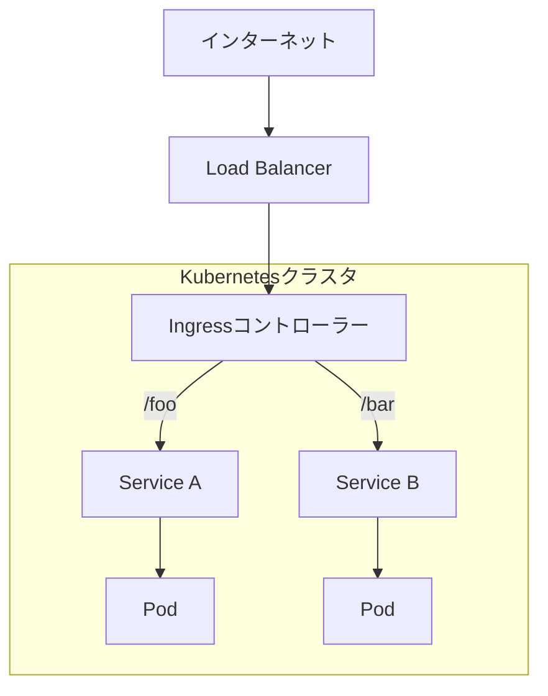

# 第9章: 高度な機能と運用

### 学習目標

- Ingressを使って、複数のサービスを単一のIPアドレスでHTTP/HTTPSルーティングできる。
- Horizontal Pod Autoscaler (HPA) を使って、負荷に応じたPodの自動スケーリングを設定できる。
- JobおよびCronJobを使って、バッチ処理や定期的なタスクを実行できる。
- RBAC（ロールベースアクセス制御）の基本を理解し、ServiceAccountに特定の権限を付与できる。

---

これまでの章で、Kubernetes上でアプリケーションを実行し、データを永続化させる方法を学びました。この章では、より本番運用に近づくために不可欠な、ルーティング、自動化、セキュリティに関する高度な機能を学びます。

## 1. 【See & Do】Ingress: クラスタへの賢い入り口

Serviceを`NodePort`や`LoadBalancer`タイプで公開する方法を学びましたが、`NodePort`は本番向きではなく、`LoadBalancer`はサービスごとに外部IPアドレスが必要になりコストがかさみます。複数のサービスを単一のIPアドレスで公開し、HTTP/HTTPSのL7ルーティング（パスやホスト名に基づく振り分け）を実現するのが**Ingress**です。

Ingressは、**Ingressリソース**（ルーティングルールの定義）と、**Ingressコントローラー**（ルールを解釈して実際にリバースプロキシとして動作するPod）の2つで構成されます。



<center>図9-1: Ingressの動作</center>

### ハンズオン: Ingressによるパスベースルーティング

1.  **Ingressコントローラーの有効化**
    Minikubeでは、アドオンとしてNginx Ingressコントローラーを簡単に有効化できます。

    ```bash
    $ minikube addons enable ingress
    ```

2.  **サンプルアプリケーションのデプロイ**
    ルーティング先となる2つの簡単なWebアプリをデプロイします。

    ```bash
    $ kubectl apply -f professional-kubernetes-hands-on/src/part3/advanced-features/hello-app.yaml
    $ kubectl apply -f professional-kubernetes-hands-on/src/part3/advanced-features/world-app.yaml
    ```

3.  **Ingressリソースの作成**
    `/hello`へのアクセスを`hello-app-service`へ、`/world`へのアクセスを`world-app-service`へ振り分けるルールを定義します。

    ```bash
    $ kubectl apply -f professional-kubernetes-hands-on/src/part3/advanced-features/example-ingress.yaml
    ```

4.  **動作確認**
    MinikubeのIPアドレスを取得し、`curl`でアクセスしてみましょう。

    ```bash
    $ IP=$(minikube ip)
    $ curl $IP/hello
    Hello, world! Version: 1.0.0 ...

    $ curl $IP/world
    Hello, world! Version: 2.0.0 ...
    ```

    パスに応じて異なるサービスに応答が転送されていることがわかります。

## 2. 【See & Do】HPA: 賢い自動スケーリング

トラフィックは常に一定ではありません。負荷に応じてPodの数を自動で増減させたい、という要求に応えるのが**Horizontal Pod Autoscaler (HPA)**です。

HPAは、**Metrics Server**というコンポーネントからPodのCPUやメモリの使用状況などのメトリクスを収集し、指定した閾値（例: CPU使用率が50%）を超えると、Deploymentの`replicas`を自動で増やしたり減らしたりします。

### ハンズオン: HPAによるCPUベースのオートスケール

1.  **Metrics Serverの有効化**

    ```bash
    $ minikube addons enable metrics-server
    ```

2.  **負荷テスト用アプリのデプロイ**
    CPUに負荷をかけることができるサンプルアプリをデプロイします。

    ```bash
    $ kubectl apply -f professional-kubernetes-hands-on/src/part3/advanced-features/hpa-demo-app.yaml
    ```

3.  **HPAリソースの作成**
    CPU使用率が平均50%を超えたら、Podを最大10個まで増やすHPAを作成します。

    ```bash
    $ kubectl apply -f professional-kubernetes-hands-on/src/part3/advanced-features/hpa.yaml
    ```

4.  **動作確認**
    別のターミナルを開き、`kubectl get hpa -w`でHPAの状態を監視します。最初の`TARGETS`は`<unknown>/50%`ですが、しばらくすると現在の使用率が表示されます。

    ```bash
    # ターミナル1
    $ kubectl get hpa -w
    NAME       REFERENCE                    TARGETS   MINPODS   MAXPODS   REPLICAS   AGE
    hpa-demo   Deployment/hpa-demo-deployment   0%/50%    1         10        1          25s
    ```

    それでは、負荷をかけてみましょう。以下のコマンドで、負荷生成用のPodを起動し、ループでリクエストを送り続けます。

    ```bash
    # ターミナル2
    $ kubectl run -it --rm load-generator --image=busybox:1.28 -- /bin/sh
    # Podの中で実行
    $ while true; do wget -q -O- http://hpa-demo-service; done
    ```

    ターミナル1のHPAの表示を見てください。`TARGETS`のCPU使用率が上昇し、`REPLICAS`の数が自動的に増えていくのが観測できます。負荷生成を止めると、数分後に`REPLICAS`が1に戻ります。

## 3. 【See & Do】Job & CronJob: 一時的なタスクの実行

Deploymentは継続的に動き続けるサービスのためのものでした。一方で、一度実行して完了するタスク（データ処理、バックアップなど）や、定期的に実行したいタスク（日次レポート生成など）もあります。

- **Job:** 1つ以上のPodを起動し、指定された数のPodが正常に完了するまでを保証します。
- **CronJob:** Jobをcronのようなスケジュール（例: `0 5 * * *`で毎日朝5時）で定期的に実行します。

### ハンズオン: JobとCronJobの実行

1.  **Jobの実行**
    円周率を2000桁計算するJobを実行してみましょう。

    ```bash
    $ kubectl apply -f professional-kubernetes-hands-on/src/part3/advanced-features/job.yaml

    # Jobの完了を確認
    $ kubectl get job pi-job
    NAME     COMPLETIONS   DURATION   AGE
    pi-job   1/1           20s        30s

    # 実行結果をログで確認
    $ kubectl logs -l job-name=pi-job
    ```

2.  **CronJobの実行**
    毎分メッセージを出力するCronJobを実行します。

    ```bash
    $ kubectl apply -f professional-kubernetes-hands-on/src/part3/advanced-features/cronjob.yaml
    ```

    `kubectl get jobs`を何度か実行すると、1分ごとに新しいJobが作成されているのがわかります。

## 4. 【See & Do】RBAC: アクセス制御

**RBAC (Role-Based Access Control)** は、「誰が」「どのリソースに」「何をしてよいか」を定義する、Kubernetesのセキュリティの根幹です。

- **Subject (誰が):** `User`, `Group`, `ServiceAccount` (PodがAPIを叩くためのアカウント)
- **Resource (何に):** `pods`, `deployments`, `services`など
- **Verb (何をする):** `get`, `list`, `watch`, `create`, `delete`など

これらを**Role**（特定の名前空間内での権限セット）または**ClusterRole**（クラスタ全体での権限セット）と、**RoleBinding**（RoleとSubjectの紐付け）または**ClusterRoleBinding**で組み合わせます。

### ハンズオン: ServiceAccountへの権限付与

Podの参照のみが許可された、読み取り専用の`ServiceAccount`を作成してみましょう。

```bash
# ServiceAccount, Role, RoleBindingをまとめて作成
$ kubectl apply -f professional-kubernetes-hands-on/src/part3/advanced-features/rbac.yaml

# 権限の確認
# `pod-reader-sa`として、Podのgetが可能か確認
$ kubectl auth can-i get pods --as=system:serviceaccount:default:pod-reader-sa
yes

# `pod-reader-sa`として、Deploymentのgetが可能か確認
$ kubectl auth can-i get deployments --as=system:serviceaccount:default:pod-reader-sa
no
```

意図通りに権限が付与されていることが確認できました。

## 5. まとめ

- **Ingress**は、クラスタへのトラフィックを集約し、賢くルーティングするL7ロードバランサーとして機能する。
- **HPA**は、CPUやメモリなどのメトリクスに基づき、アプリケーションを自動でスケールアウト／インさせる。
- **Job**は一回限りのタスクを、**CronJob**は定期的なタスクを実行するのに適している。
- **RBAC**は、`Role`, `RoleBinding`などを通じて、Kubernetesクラスタ内のリソースへのアクセスをきめ細かく制御する。

## 6. 【Check】理解度チェック

1.  あなたのチームは5つの異なるWebサービスを運用しており、それぞれに`LoadBalancer`タイプのServiceを使っています。コストを削減するため、単一の外部IPアドレスで全てのサービスを公開したいと考えています。どのリソースを導入すべきですか？また、ホスト名（例: `a.example.com`, `b.example.com`）に基づいてトラフィックを振り分けるには、そのリソースで何を定義しますか？
2.  HPAが正しく動作するために、クラスタに必須のコンポーネントは何ですか？また、HPAがDeploymentのPodをスケールアウトさせるのは、どのような状況ですか？
3.  毎晩深夜2時にデータベースのバックアップを取得する処理をKubernetes上で自動化したいです。JobとCronJobのどちらを使いますか？その理由も説明してください。
