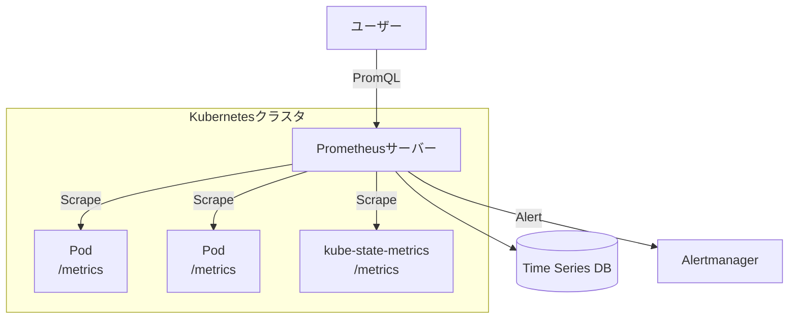
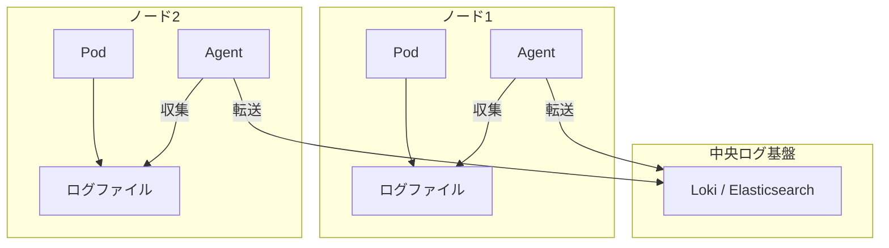

# 第10章: 監視とロギング

### 学習目標

- 監視とロギングが本番運用でなぜ不可欠なのかを説明できる。
- Prometheusのプル型モデルと、Grafanaによる可視化の役割を理解する。
- Helmを使い、`kube-prometheus-stack`をクラスタにデプロイできる。
- Grafanaのダッシュボードを操作し、クラスタのメトリクスを確認できる。
- 中央集権ロギングのアーキテクチャを理解し、LokiとPromtailの役割を説明できる。

---

アプリケーションをデプロイして公開するだけでは、本番運用は始まりません。システムが正常に動作しているか、パフォーマンスに問題はないか、エラーが発生していないかを常に把握する必要があります。これを実現するのが**監視 (Monitoring)** と **ロギング (Logging)** であり、合わせて**可観測性 (Observability)** と呼ばれます。

## 1. 【See】Prometheusによるメトリクス監視

**Prometheus**は、Cloud Native Computing Foundation (CNCF) の卒業プロジェクトであり、Kubernetes環境におけるメトリクス監視のデファクトスタンダードです。

Prometheusは**プル型モデル**を採用しています。これは、Prometheusサーバーが、監視対象（Podやノードなど）が公開しているHTTPエンドポイント（`/metrics`）に定期的にアクセスし、メトリクスを収集（scrape）する方式です。



<center>図10-1: Prometheusのプル型アーキテクチャ</center>

収集したデータは時系列データベース（TSDB）に保存され、**PromQL**という強力なクエリ言語で集計・分析できます。また、**Alertmanager**というコンポーネントと連携し、特定の条件（例: CPU使用率が80%を5分間超えた）でアラートを発報することもできます。

## 2. 【See】Grafanaによる可視化

Prometheusはデータの収集と保存、クエリに優れていますが、その結果を人間が見やすいグラフにする機能は限定的です。そこで登場するのが**Grafana**です。

Grafanaは、Prometheusをはじめとする様々なデータソースに接続し、そのデータをリッチなグラフやダッシュボードとして可視化するためのツールです。PrometheusとGrafanaの組み合わせは、Kubernetes監視における黄金コンビと言えます。

## 3. 【Do】kube-prometheus-stackの導入

これらのツールを個別にインストールするのは大変ですが、**Helm**というKubernetesのパッケージマネージャーを使えば、全てがプリセットされた`kube-prometheus-stack`をコマンド一つで導入できます。

### Step 1: Helmのインストール

まだHelmをインストールしていない場合は、公式サイトの手順に従ってください。

- [Helm 公式インストールガイド](https://helm.sh/docs/intro/install/)

### Step 2: Helmリポジトリの追加

```bash
$ helm repo add prometheus-community https://prometheus-community.github.io/helm-charts
$ helm repo update
```

### Step 3: kube-prometheus-stackのインストール

```bash
# monitoringという名前空間を作成し、そこにインストール
$ kubectl create namespace monitoring
$ helm install prometheus prometheus-community/kube-prometheus-stack --namespace monitoring
```

このコマンドだけで、Prometheus, Grafana, Alertmanager, そして各種Exporter（ノードやKubernetesコンポーネントのメトリクスを公開するツール）が全てデプロイされます。

### Step 4: Grafanaへのアクセス

GrafanaのログインパスワードはSecretとして保存されています。以下のコマンドで取得します。

```bash
$ kubectl get secret prometheus-grafana -n monitoring -o jsonpath="{.data.admin-password}" | base64 --decode
```

次に、`kubectl port-forward`を使って、ローカルPCからGrafanaのPodにアクセスできるようにします。

```bash
# 別のターミナルで実行
$ kubectl port-forward svc/prometheus-grafana 3000:80 -n monitoring
```

ブラウザで `http://localhost:3000` を開き、ユーザー名`admin`と先ほど取得したパスワードでログインしてください。

### Step 5: ダッシュボードの探検

ログイン後、左側のメニューから「Dashboards」を開くと、既に多数のダッシュボードが用意されていることがわかります。「Kubernetes / Compute Resources / Cluster」などのダッシュボードを開いてみましょう。クラスタ全体のCPUやメモリ使用率、各Podのリソース消費量などがリアルタイムで可視化されており、監視の力を実感できるはずです。

## 4. 【See】中央集権ロギング

`kubectl logs`は単一のPodのログを見るには便利ですが、Podが再作成されるとログは消え、複数のPodのログを横断的に検索することもできません。そこで、各ノードで動作する**ログ収集エージェント**がコンテナのログを収集し、**中央のログ基盤**に転送するアーキテクチャが一般的です。

- **ログ収集エージェント:** Fluentd, Fluent Bit, Promtailなど。DaemonSetとして各ノードで実行される。
- **ログ基盤:** Elasticsearch, **Loki**など。



<center>図10-2: 中央集権ロギングのアーキテクチャ</center>

Grafana社が開発した**Loki**は、Prometheusからインスピレーションを得ており、ログに大量のインデックスを付けるのではなく、Podのラベルなどのメタデータだけをインデックス化することで、軽量かつコスト効率が高いのが特徴です。

## 5. 【Do】Lokiによるロギング

Lokiと、そのログ収集エージェントである**Promtail**もHelmで簡単に導入できます。

```bash
$ helm repo add grafana https://grafana.github.io/helm-charts
$ helm repo update
$ helm install loki grafana/loki-stack --namespace monitoring
```

インストールが完了したら、GrafanaのUIに戻り、左側メニューの「Configuration」→「Data Sources」を開きます。自動で`loki`というデータソースが追加されているはずです。

左側メニューの「Explore」を開き、データソースとして`loki`を選択してください。`Log browser`ボタンを押し、`app`などのラベルでフィルタリングすると、クラスタ内のPodのログが横断的に検索・表示できます。これにより、`kubectl logs`よりもはるかに強力なログ分析が可能になります。

## 6. まとめ

- 可観測性は、システムの健全性を保ち、問題解決を迅速化するために不可欠である。
- **Prometheus**はメトリクスを収集・保存し、**Grafana**はそれを可視化する。
- **Helm**パッケージマネージャーを使えば、`kube-prometheus-stack`のような複雑なアプリケーションも簡単に導入できる。
- 中央集権ロギングは、各ノードの**ログ収集エージェント**がログを**ログ基盤**に集約することで実現される。
- **Loki**は、Prometheusライクなラベルベースのアプローチを採用した、軽量で効率的なログ基盤である。

## 7. 【Check】理解度チェック

1.  PrometheusとGrafanaの関係性を説明してください。それぞれの主な役割は何ですか？
2.  Kubernetesクラスタの各ノードのCPUやメモリ使用率といったメトリクスを収集する役割を担うのは、`kube-prometheus-stack`に含まれるどのコンポーネントですか？（ヒント: Exporterの一種です）
3.  本番環境において、`kubectl logs`だけではログ管理が不十分である理由は何ですか？中央集権ロギングの基本的なアーキテクチャを説明してください。
