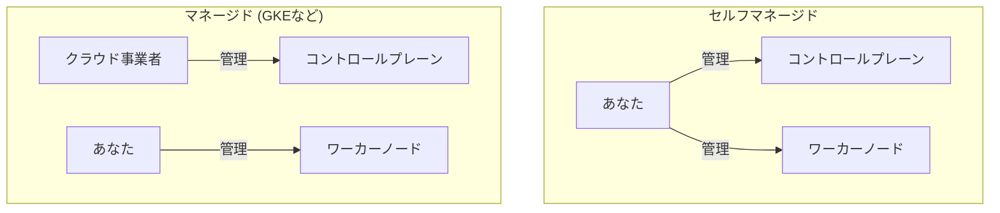

# 第11章: Google Kubernetes Engine (GKE)

### 学習目標

- マネージドKubernetesの利点と、GKEの基本的な特徴を説明できる。
- `gcloud` CLIを使い、GKEクラスタを作成・管理できる。
- アプリケーションのコンテナイメージをArtifact Registryにpushできる。
- `LoadBalancer`タイプのServiceを使い、アプリケーションをインターネットに公開できる。
- Workload Identityの概念を理解する。

---

これまでの章では、ローカル環境のMinikubeでKubernetesを学んできました。しかし、本番環境では、コントロールプレーンの可用性、セキュリティ、アップグレードなどを自分たちで管理するのは非常に大変な作業です。そこで登場するのが、**マネージドKubernetesサービス**です。

## 1. 【See】マネージドKubernetesの利点

Google Kubernetes Engine (GKE)、Amazon Elastic Kubernetes Service (EKS)、Azure Kubernetes Service (AKS) に代表されるマネージドサービスは、クラウドプロバイダーがコントロールプレーンの運用を全て代行してくれます。



<center>図11-1: セルフマネージド vs マネージドKubernetes</center>

これにより、私たちはアプリケーションの開発と、ワーカーノード上で動くワークロードの管理に集中できます。コントロールプレーンの複雑な運用から解放されることが、マネージドサービス最大のメリットです。

### GKEの動作モード: Standard vs Autopilot

GKEには2つの動作モードがあります。

- **Standard:** ワーカーノードのスペックや数を自分で細かく管理するモード。柔軟性が高い。
- **Autopilot:** ワーカーノードの管理をGKEに完全に任せるモード。Podをデプロイするだけで、必要なリソースが自動でプロビジョニングされます。運用負荷が低く、小規模なアプリや学習に最適です。

この章では、より手軽な**Autopilot**モードを使います。

## 2. 【Do】GCP環境の準備

ハンズオンに進む前に、ご自身のGCP環境で以下の準備が必要です。

1.  **GCPアカウントの作成:** まだアカウントがない場合は、[GCP公式サイト](https://cloud.google.com/)から作成してください。無料トライアルが利用できます。
2.  **GCPプロジェクトの作成:** 新しいプロジェクトを作成し、プロジェクトIDを控えておきます。
3.  **課金の有効化:** GKEの利用には課金の有効化が必要です。
4.  **APIの有効化:** GKEとArtifact RegistryのAPIを有効化します。
    ```bash
    gcloud services enable container.googleapis.com artifactregistry.googleapis.com
    ```
5.  **`gcloud` CLIのインストールと設定:** [公式ガイド](https://cloud.google.com/sdk/docs/install)に従い`gcloud` CLIをインストールし、初期設定を済ませます。
    ```bash
    gcloud init
    gcloud config set project YOUR_PROJECT_ID
    ```

## 3. 【Do】GKE Autopilotクラスタの作成

`gcloud`コマンドを使って、Autopilotクラスタを作成します。リージョンは`asia-northeast1`（東京）などを指定します。

```bash
$ gcloud container clusters create-auto my-gke-cluster --region=asia-northeast1

# ☕ クラスタの作成には5〜10分程度かかります
```

作成が完了したら、`kubectl`がこの新しいクラスタと通信できるように設定します。

```bash
$ gcloud container clusters get-credentials my-gke-cluster --region=asia-northeast1
```

`kubectl get nodes`を実行し、GKEによってプロビジョニングされたノードが表示されれば成功です。

## 4. 【Do】GKEへのアプリケーションデプロイ

第7章で使ったマイクロサービスアプリケーションをGKEにデプロイします。主な手順は以下の通りです。

1.  コンテナイメージを、GKEがアクセスできる**Artifact Registry**にPushする。
2.  DeploymentのYAMLを修正し、Artifact Registryのイメージパスを指定する。
3.  ServiceのYAMLを修正し、外部に公開するための`LoadBalancer`タイプに変更する。

### Step 1: Artifact RegistryへのイメージPush

まず、イメージを保存するためのリポジトリを作成します。

```bash
$ gcloud artifacts repositories create my-app-repo --repository-format=docker --location=asia-northeast1
```

次に、第2章で作成した`nodejs-hello:1.0`イメージに、Artifact Registry用の新しいタグを付けます。

```bash
# Artifact Registryのホスト名
$ HOST=asia-northeast1-docker.pkg.dev
# プロジェクトID
$ PROJECT_ID=$(gcloud config get-value project)
# リポジトリ名
$ REPO=my-app-repo

# イメージにタグ付け
$ docker tag nodejs-hello:1.0 ${HOST}/${PROJECT_ID}/${REPO}/nodejs-hello:1.0
```

`gcloud` CLIを使ってDockerの認証設定を行い、イメージをPushします。

```bash
$ gcloud auth configure-docker ${HOST}
$ docker push ${HOST}/${PROJECT_ID}/${REPO}/nodejs-hello:1.0
```

### Step 2: Kubernetes YAMLの修正

`professional-kubernetes-hands-on/src/part3/microservice-app/`にある2つのファイルを修正します。

**`node-app-deployment.yaml`の修正:**

- `image:`の値を、先ほどPushしたArtifact Registryのパスに書き換えます。
- `imagePullPolicy: Never`を削除するか、`IfNotPresent`に変更します。

```yaml
# ...
containers:
  - name: node-app
    image: asia-northeast1-docker.pkg.dev/YOUR_PROJECT_ID/my-app-repo/nodejs-hello:1.0
    imagePullPolicy: IfNotPresent
# ...
```

**`node-app-service.yaml`の修正:**

- `type: NodePort`を`type: LoadBalancer`に変更します。
- `nodePort: 30080`の行を削除します。

```yaml
# ...
spec:
  type: LoadBalancer
  ports:
    - port: 80 # 外部からのアクセスは80番ポート
      targetPort: 3000
# ...
```

### Step 3: GKEへの適用と動作確認

修正したYAMLファイルを含むディレクトリで、`kubectl apply`を実行します。

```bash
$ cd professional-kubernetes-hands-on/src/part3/microservice-app
$ kubectl apply -f .
```

`kubectl get service node-app-service -w`を実行し、`EXTERNAL-IP`が`<pending>`から実際のIPアドレスに変わるのを待ちます（数分かかります）。

```bash
$ kubectl get service node-app-service
NAME               TYPE           CLUSTER-IP    EXTERNAL-IP     PORT(S)        AGE
node-app-service   LoadBalancer   10.4.12.123   35.123.45.67    80:32123/TCP   5m
```

払い出された`EXTERNAL-IP`にブラウザでアクセスし、アプリケーションが表示されれば成功です！

## 5. 【See】GCPサービスとの連携

### Cloud Load Balancer

Serviceを`LoadBalancer`タイプで作成すると、GKEは自動的にGoogle Cloudの**Cloud Load Balancer**をプロビジョニングし、バックエンドのPodにトラフィックを転送するように設定してくれます。これがマネージドサービスならではの強力な連携機能です。

### Workload Identity

PodからCloud StorageやBigQueryなどの他のGCPサービスにアクセスしたい場合、どのように認証すればよいでしょうか。サービスアカウントキーをSecretとして保存する方法もありますが、漏洩リスクがありベストプラクティスではありません。

**Workload Identity**は、KubernetesのServiceAccount (KSA) とGCPのIAM Service Account (GSA) を紐付けることで、PodがGCPサービスに対して安全に認証できるようにするGKE推奨の仕組みです。これにより、キーを管理する必要がなくなります。

## 6. まとめ

- マネージドKubernetesは、コントロールプレーンの運用をクラウド事業者に任せることで、開発者がアプリケーションに集中できるようにする。
- GKEは、StandardモードとAutopilotモードの2種類を提供する。
- GKEで自作イメージを使うには、Artifact RegistryのようなコンテナレジストリにイメージをPushする必要がある。
- `LoadBalancer`タイプのServiceを作成すると、GCPのロードバランサーが自動でプロビジョニングされ、アプリケーションを簡単にインターネットへ公開できる。

## 7. 【Check】理解度チェック

1.  Kubernetesクラスタを自前で構築・運用する場合と比較して、GKEのようなマネージドサービスを利用する最大の利点は何ですか？
2.  ローカルマシンでビルドしたコンテナイメージをGKEクラスタのPodで利用可能にするためには、どのような手順が必要ですか？
3.  GKE上でアプリケーションをインターネットに公開し、独自のパブリックIPアドレスを付与したいです。Serviceリソースの`type`には何を指定しますか？また、その際にGKEが自動で作成してくれるGCPのリソースは何ですか？
