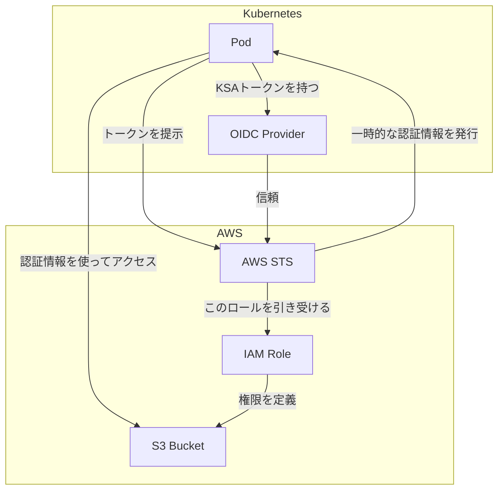

# 第12章: Amazon Elastic Kubernetes Service (EKS)

### 学習目標

- EKSのアーキテクチャと、GKEとの概念的な違いを理解する。
- `eksctl`を使い、EKSクラスタを効率的に作成・管理できる。
- アプリケーションのコンテナイメージをAmazon ECRにpushできる。
- IAM Roles for Service Accounts (IRSA) の役割を理解し、PodにAWSリソースへの権限を安全に付与する仕組みを説明できる。
- AWS Load Balancer Controllerの役割を理解する。

---

前章ではGKEについて学びました。この章では、クラウド市場で最大のシェアを誇るAWSが提供するマネージドKubernetesサービス、**Amazon EKS**を探求します。EKSは、AWSの豊富なサービス群との深い統合を特徴としています。

## 1. 【See】EKSのアーキテクチャと`eksctl`

EKSの基本的な考え方はGKEと同じで、AWSがコントロールプレーンを管理し、ユーザーはワーカーノードを管理します。しかし、アーキテクチャには重要な違いがあります。EKSのコントロールプレーンはAWSが管理するVPC（Virtual Private Cloud）で実行され、ワーカーノードは**ユーザーが管理するVPC**内で実行されます。これにより、ユーザーは自社のネットワーク要件に合わせて、より柔軟にネットワークを構成できます。

このクラスタ構築プロセスは、VPC、サブネット、IAMロール、EC2インスタンスなど多数のAWSリソースを作成する必要があり、手動で行うと非常に複雑です。そこで登場するのが、Weaveworks社によって開発され、AWSの公式CLIとなった**`eksctl`**です。

`eksctl`は、簡単なコマンド一つで、AWS CloudFormationを裏側で駆使し、EKSクラスタの構築に必要な全てのコンポーネントを自動でプロビジョニングしてくれます。

## 2. 【Do】AWS環境の準備

ハンズオンに進む前に、ご自身のAWS環境で以下の準備が必要です。

1.  **AWSアカウントの作成:** [AWS公式サイト](https://aws.amazon.com/)からアカウントを作成します。無料利用枠が利用可能です。
2.  **IAMユーザーの作成:** `eksctl`がAWSリソースを作成するための十分な権限を持つIAMユーザーを作成し、アクセスキーとシークレットアクセスキーを発行しておきます。
3.  **`aws` CLIのインストールと設定:** [公式ガイド](https://docs.aws.amazon.com/cli/latest/userguide/getting-started-install.html)に従い`aws` CLIをインストールし、先ほど発行したキーを使ってプロファイルを設定します。
    ```bash
    $ aws configure
    ```
4.  **`eksctl`のインストール:** [公式ガイド](https://eksctl.io/introduction/#installation)に従い`eksctl`をインストールします。

## 3. 【Do】EKSクラスタの作成

`eksctl`を使って、シンプルなEKSクラスタを作成します。`--node-type`には、無料利用枠の対象となる`t2.micro`や、より汎用的な`t3.medium`などを指定します。

```bash
$ eksctl create cluster \
    --name my-eks-cluster \
    --region ap-northeast-1 \
    --nodegroup-name standard-workers \
    --node-type t3.medium \
    --nodes 2

# ☕ VPCやEC2インスタンスなど多数のリソースを作成するため、15〜20分程度かかります
```

クラスタが作成されると、`eksctl`は自動的に`~/.kube/config`ファイルを更新し、`kubectl`が新しいEKSクラスタと通信できるように設定してくれます。`kubectl get nodes`で2つのワーカーノードが表示されることを確認してください。

## 4. 【Do】EKSへのアプリケーションデプロイ

GKEの時と同様に、EKSにアプリケーションをデプロイします。KubernetesのYAML定義はポータブルなので、修正点はイメージのパスとServiceのタイプだけです。

### Step 1: Amazon ECRへのイメージPush

Amazon ECR (Elastic Container Registry) は、AWSのマネージドコンテナレジストリです。

まず、ECRにリポジトリを作成します。

```bash
$ aws ecr create-repository --repository-name my-app-repo --region ap-northeast-1
```

次に、ECRにログインするための認証情報を取得し、Dockerをログインさせます。

```bash
# AWSアカウントIDを取得
$ AWS_ACCOUNT_ID=$(aws sts get-caller-identity --query Account --output text)
$ REGION=ap-northeast-1

$ aws ecr get-login-password --region ${REGION} | docker login --username AWS --password-stdin ${AWS_ACCOUNT_ID}.dkr.ecr.${REGION}.amazonaws.com
```

`nodejs-hello:1.0`イメージにECR用のタグを付け、Pushします。

```bash
$ ECR_HOST=${AWS_ACCOUNT_ID}.dkr.ecr.${REGION}.amazonaws.com
$ REPO=my-app-repo

$ docker tag nodejs-hello:1.0 ${ECR_HOST}/${REPO}:1.0
$ docker push ${ECR_HOST}/${REPO}:1.0
```

### Step 2: Kubernetes YAMLの修正と適用

GKEの時と同様に、`node-app-deployment.yaml`の`image`をECRのパスに書き換え、`node-app-service.yaml`の`type`を`LoadBalancer`に変更します。

修正後、`kubectl apply`を実行します。

```bash
$ cd professional-kubernetes-hands-on/src/part3/microservice-app
$ kubectl apply -f .
```

`kubectl get service node-app-service -w`で`EXTERNAL-IP`が払い出されるのを待ちます。EKSの場合、払い出されるのはIPアドレスではなく、`xxxx.elb.amazonaws.com`のようなDNS名です。このDNS名にブラウザでアクセスし、アプリが表示されることを確認してください。

## 5. 【See】IAM Roles for Service Accounts (IRSA)

PodからS3やDynamoDBなどのAWSサービスにアクセスするには、AWSの認証情報が必要です。この認証を実現するEKS推奨の仕組みが**IRSA (IAM Roles for Service Accounts)**です。

これはGKEのWorkload Identityに相当する機能で、KubernetesのServiceAccount (KSA) とAWSのIAMロールを紐付けます。PodはKSAを通じて一時的なIAMロールを引き受け、AWSサービスに安全にアクセスできます。これにより、IAMユーザーのアクセスキーをPodに埋め込むといった危険な方法を避けることができます。



<center>図12-1: IRSAの仕組み</center>

## 6. 【See】AWS Load Balancer Controller

デフォルトで`LoadBalancer`タイプのServiceを作成すると、古典的なClassic Load Balancer (CLB) またはNetwork Load Balancer (NLB) が作成されます。これはL4（トランスポート層）のロードバランサーです。

Ingressリソースを使って、より高度なL7（アプリケーション層）のルーティング（パスベース、ホストベースなど）を行いたい場合は、**AWS Load Balancer Controller**というアドオンをクラスタにインストールする必要があります。このコントローラーは、クラスタ内のIngressリソースを監視し、その定義に基づいて**Application Load Balancer (ALB)**を自動でプロビジョニング・設定してくれます。

## 7. まとめ

- EKSは、コントロールプレーンをAWSが、ワーカーノードをユーザーが管理するモデルを採用している。
- `eksctl`は、EKSクラスタの構築に必要な複雑なAWSリソースの作成を自動化する強力なツールである。
- EKSで自作イメージを使うには、Amazon ECRのようなコンテナレジストリにイメージをPushする必要がある。
- **IRSA**は、IAMロールとKubernetesのServiceAccountを連携させ、Podに安全なAWSリソースへのアクセス権を付与する仕組みである。
- 高度なL7ルーティングには、**AWS Load Balancer Controller**を導入し、Ingressリソース経由でALBを利用するのが一般的である。

## 8. 【Check】理解度チェック

1.  EKSクラスタをコマンドラインから作成する際に推奨されるツールは何ですか？そのツールが裏側で何を行っているか簡潔に説明してください。
2.  IRSAとは何の略で、PodがS3のようなAWSサービスにアクセスする必要がある場合に、どのようなセキュリティ上の問題を解決しますか？
3.  EKS上で、`/api/users`へのアクセスは`user-service`へ、`/api/products`へのアクセスは`product-service`へ振り分ける、といったパスベースのルーティングを実現したいです。どのようなリソースと、どのような追加コンポーネントが必要になりますか？

```

```
