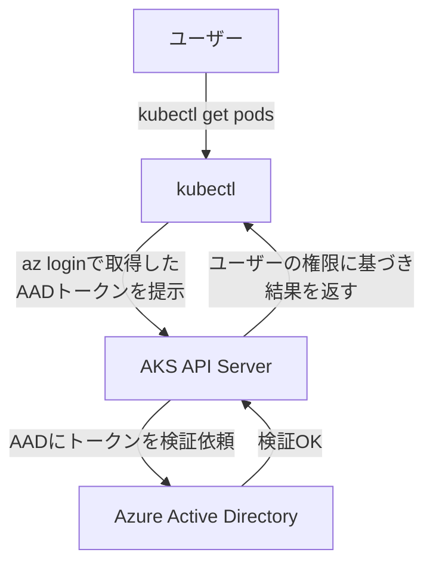

# 第13章: Azure Kubernetes Service (AKS)

### 学習目標

- AKSの基本的な特徴と、Azureサービスとの統合について理解する。
- Azure CLI (`az`) を使い、AKSクラスターを作成・管理できる。
- アプリケーションのコンテナイメージをAzure Container Registry (ACR)にpushできる。
- Azure Active Directory (AAD) 統合の利点を説明できる。
- Azure Monitor for containersの役割を理解する。

---

マネージドKubernetesを巡る旅の最後として、Microsoft Azureが提供する**Azure Kubernetes Service (AKS)**を取り上げます。AKSは、特にAzure Active Directory (AAD)やGitHub/Azure DevOpsといった、Microsoftのエコシステムとの強力な統合を特徴としています。

## 1. 【See】AKSのコアコンセプト

AKSの基本的なアーキテクチャはGKEやEKSと類似しており、Azureがコントロールプレーンを管理します。Azureにおける特徴的な概念は**リソースグループ (Resource Group)**です。リソースグループは、AKSクラスタ、仮想ネットワーク、ディスクなど、関連するAzureリソースをまとめて管理するための論理的なコンテナです。プロジェクトのライフサイクルに合わせて、リソースグループごとリソースをまとめて作成・削除できます。

Azureの操作には、**Azure CLI (`az`)**という統一されたコマンドラインツールが提供されており、AKSクラスタの管理もこの`az`コマンドを通じて行います。

## 2. 【Do】Azure環境の準備

ハンズオンに進む前に、ご自身のAzure環境で以下の準備が必要です。

1.  **Azureアカウントの作成:** [Azure公式サイト](https://azure.microsoft.com/free/)から無料アカウントを作成します。
2.  **Azure CLIのインストール:** [公式ガイド](https://docs.microsoft.com/cli/azure/install-azure-cli)に従い、`az` CLIをインストールします。
3.  **Azureへのログイン:** コマンドラインからAzureにログインします。ブラウザが開き、認証を求められます。
    ```bash
    $ az login
    ```

## 3. 【Do】AKSクラスタの作成

`az` CLIを使って、AKSクラスタをデプロイします。

### Step 1: リソースグループの作成

まず、AKSクラスタを格納するためのリソースグループを作成します。

```bash
$ az group create --name myResourceGroup --location eastus
```

### Step 2: AKSクラスタの作成

次に、作成したリソースグループ内にAKSクラスタを作成します。`--node-count 1`でワーカーノードを1台に指定します。

```bash
$ az aks create \
    --resource-group myResourceGroup \
    --name myAKSCluster \
    --node-count 1 \
    --enable-addons monitoring \
    --generate-ssh-keys

# ☕ クラスタの作成には10〜15分程度かかります
```

### Step 3: kubectlの設定

`az`コマンドを使って、`kubectl`がAKSクラスタと通信できるように設定します。このコマンドは自動で`~/.kube/config`ファイルに設定を追記してくれます。

```bash
$ az aks get-credentials --resource-group myResourceGroup --name myAKSCluster
```

`kubectl get nodes`を実行し、AKSのノードが表示されることを確認してください。

## 4. 【Do】AKSへのアプリケーションデプロイ

ここからの手順はGKEやEKSとほぼ同じです。Kubernetesのポータビリティの高さを実感できます。

### Step 1: Azure Container Registry (ACR)へのイメージPush

ACRは、Azureのマネージドコンテナレジストリです。

まず、ACRインスタンスを作成します。SKUにはBasicを指定します。

```bash
$ az acr create --resource-group myResourceGroup --name myacrregistry --sku Basic
```

次に、ACRにログインします。

```bash
$ az acr login --name myacrregistry
```

`nodejs-hello:1.0`イメージにACR用のタグを付け、Pushします。

```bash
$ ACR_HOST=myacrregistry.azurecr.io
$ REPO=nodejs-hello

$ docker tag nodejs-hello:1.0 ${ACR_HOST}/${REPO}:1.0
$ docker push ${ACR_HOST}/${REPO}:1.0
```

最後に、作成したAKSクラスタがこのACRからイメージをプルできるように、権限を付与します。

```bash
$ az aks update -n myAKSCluster -g myResourceGroup --attach-acr myacrregistry
```

### Step 2: Kubernetes YAMLの修正と適用

`node-app-deployment.yaml`の`image`をACRのパスに書き換え、`node-app-service.yaml`の`type`を`LoadBalancer`に変更します。修正後、`kubectl apply`を実行します。

### Step 3: 動作確認

`kubectl get service node-app-service -w`で`EXTERNAL-IP`が払い出されるのを待ち、そのIPアドレスにブラウザでアクセスして、アプリが表示されることを確認してください。

## 5. 【See】Azureサービスとの統合

### Azure Active Directory (AAD) 統合

AKSの最も強力な特徴の一つが、AzureのID・アクセス管理サービスである**Azure Active Directory (AAD)**との統合です。AKSクラスタでAAD統合を有効にすると、`kubectl`などのKubernetes APIへのアクセス認証に、普段使っているAzureのユーザーアカウント（AADアカウント）を利用できます。

これにより、組織の既存のID管理基盤とKubernetesの認証を統一でき、セキュリティとガバナンスを大幅に向上させることができます。



<center>図13-1: AAD統合による認証フロー</center>

### Azure Monitor for containers

クラスタ作成時に`--enable-addons monitoring`オプションを付けたことで、AKSクラスタのメトリクスとログは自動的に**Azure Monitor**に収集されています。Azure Monitorは、Azureプラットフォームに組み込まれた統合監視ソリューションです。

Azureポータルにアクセスし、作成したAKSクラスタのリソースページを開くと、「監視」セクションからコンテナのパフォーマンス（CPU、メモリ）やログを直接確認できます。Prometheus/Grafanaスタックを自前で構築・管理することなく、基本的な可観測性がすぐに得られるのが利点です。

## 6. まとめ

- AKSは、AzureのマネージドKubernetesサービスであり、特に他のAzureサービスとの親和性が高い。
- **リソースグループ**は、AKSクラスタを含む関連リソースをまとめるための論理的なコンテナである。
- **`az` CLI**は、AKSクラスタの作成から`kubectl`の設定までを一貫して行える。
- **AAD統合**により、Kubernetesの認証を組織のID基盤と統一でき、セキュリティが向上する。
- **Azure Monitor**アドオンを有効にすることで、追加設定なしで基本的な監視・ロギング機能を利用できる。

## 7. 【Check】理解度チェック

1.  Azureにおいて、AKSクラスタやそれに関連する仮想ネットワーク、ディスクなどを論理的にまとめるためのコンテナの役割を果たすリソースは何ですか？
2.  AKSをAzure Active Directory (AAD)と統合する主な利点は何ですか？セキュリティ管理者の視点から説明してください。
3.  AKSクラスタの作成時に監視アドオンを有効にしました。デプロイしたアプリケーションのPodのCPU使用率を確認したい場合、どこを見に行けばよいですか？
