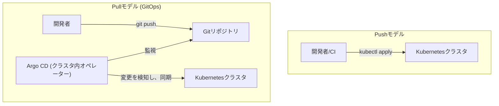

# 第15章: 本番運用のベストプラクティス

### 学習目標

- GitOpsの概念を理解し、Argo CDを使ってGitOpsワークフローを実践できる。
- Canaryデプロイメントなどの高度なデプロイ戦略の利点を説明できる。
- ディザスタリカバリとコスト最適化に関する基本的な考え方を理解する。

---

Kubernetesの旅も、いよいよ最終章です。これまでに、コンテナの作成から、Kubernetes上でのデプロイ、永続化、セキュリティ、監視に至るまで、幅広い知識を身につけてきました。この章では、それらの知識を統合し、現代的な本番環境を効率的かつ安全に運用するためのベストプラクティスを探求します。

## 1. 【See】GitOps: 現代的なKubernetes運用

これまで、私たちは`kubectl apply -f`コマンドを使って、手元のYAMLファイルをクラスタに適用（**Push**）してきました。これはCI/CDパイプラインから自動化することもできますが、いくつかの課題があります。

- パイプラインがクラスタへの強い権限を持つ必要がある。
- Git上の定義と、実際のクラスタの状態が乖離（ドリフト）する可能性がある。
- 誰がいつクラスタをどう変更したかの監査が難しい。

これらの課題を解決するのが**GitOps**というアプローチです。

**GitOps**とは、Gitリポジトリを**信頼できる唯一の情報源 (Single Source of Truth)** とし、クラスタ内で動作するエージェントがGitリポジトリの状態を監視し、クラスタの実際の状態をGitの状態に自動的に同期（**Pull**）させる運用モデルです。



<center>図15-1: Pushモデル vs Pullモデル (GitOps)</center>

このモデルでは、クラスタへの変更はすべてGitへのコミットを通じて行われるため、変更履歴がすべて残り、レビューやロールバックも容易になります。**Argo CD**は、GitOpsを実現するための代表的なオープンソースツールです。

## 2. 【Do】Argo CDによるGitOpsワークフロー体験

### Step 1: Argo CDのインストール

```bash
$ kubectl create namespace argocd
$ kubectl apply -n argocd -f https://raw.githubusercontent.com/argoproj/argo-cd/stable/manifests/install.yaml
```

### Step 2: Argo CD UIへのアクセス

Argo CDのAPIサーバーは、デフォルトでは外部に公開されていません。`port-forward`を使ってアクセスします。

```bash
# 別のターミナルで実行
$ kubectl port-forward svc/argocd-server -n argocd 8080:443
```

次に、初期パスワードを取得します。

```bash
$ kubectl -n argocd get secret argocd-initial-admin-secret -o jsonpath="{.data.password}" | base64 -d
```

ブラウザで `https://localhost:8080` を開き、証明書の警告を承認して進みます。ユーザー名`admin`と取得したパスワードでログインしてください。

### Step 3: Gitリポジトリの準備

このハンズオンでは、あなた自身のGitHubリポジトリが必要です。

1. 新しいパブリックリポジトリをGitHub上で作成します。
2. 第7章で作成した`professional-kubernetes-hands-on/src/part3/microservice-app/`ディレクトリの中身（YAMLファイル群）を、作成したリポジトリにPushします。

### Step 4: Argo CDアプリケーションの作成

Argo CDのUIで、「+ NEW APP」をクリックし、以下の情報を入力します。

- **Application Name:** `my-microservice-app`
- **Project:** `default`
- **Sync Policy:** `Manual`
- **Repository URL:** あなたが作成したGitHubリポジトリのURL
- **Revision:** `HEAD`
- **Path:** `.` (リポジトリのルートディレクトリを指す)
- **Cluster URL:** `https://kubernetes.default.svc`
- **Namespace:** `default`

「CREATE」ボタンを押すと、アプリケーションカードが作成されます。

### Step 5: 同期とデプロイ

作成されたカードは`OutOfSync`状態のはずです。「SYNC」ボタンを押し、表示されるダイアログでもう一度「SYNCHRONIZE」を押してください。Argo CDがGitリポジトリのYAMLを読み込み、クラスタに適用します。しばらくすると`Healthy`かつ`Synced`状態になり、リソースがツリー状に表示されます。

### Step 6: GitOpsの魔法

Gitリポジトリ側で`node-app-deployment.yaml`を開き、`replicas`を`2`から`3`に変更してコミット＆プッシュしてください。

Argo CDのUIに戻り、「REFRESH」ボタンを押すと、アプリケーションが`OutOfSync`状態になるのがわかります。`node-app-deployment`のリソースに差分が表示されます。「SYNC」を再度実行すると、クラスタ上のDeploymentのレプリカ数が3に更新されます。これがGitOpsのワークフローです！

## 3. 【See】高度なデプロイ戦略

ローリングアップデートは便利ですが、問題があった場合に影響が広がる可能性があります。より安全なデプロイ戦略を紹介します。

- **Blue-Greenデプロイメント:** 現在の環境（Blue）と全く同じ構成で新しいバージョンの環境（Green）を用意します。テストが完了したら、ロードバランサーの向き先をBlueからGreenに一気に切り替えます。問題があれば即座にBlueに戻せます。
- **Canary（カナリア）デプロイメント:** 新しいバージョンを本番環境のごく一部（例: 5%のユーザー）にだけリリースし、エラー率などを監視します。問題がなければ、徐々に新しいバージョンへのトラフィックの割合を増やしていき、最終的に100%にします。リスクを最小限に抑えることができます。

これらの高度な戦略は、**Argo Rollouts**や**Flagger**といったツールと、**Istio**や**Linkerd**といったサービスメッシュを組み合わせることで実現できます。

## 4. 【See】DRとコスト最適化

### ディザスタリカバリ (DR)

万が一クラスタが失われた場合に備えるのがDRです。GitOpsは、新しいクラスタにArgo CDを向けるだけでアプリケーションを迅速に復元できるため、強力なDRツールとなります。また、**Velero**のようなツールを使い、`etcd`の状態やPersistent Volumeのスナップショットを定期的にバックアップすることも重要です。

### コスト最適化

Kubernetesのコストは気付かぬうちに増大します。以下の点を意識すると良いでしょう。

- **リソース要求/制限の適正化:** Podの`resources`設定を、実際の使用量に合わせて適切に設定し、無駄をなくします。
- **Cluster Autoscaler:** クラスタ全体の負荷に応じて、ワーカーノードの数を自動で増減させます。
- **スポットインスタンスの活用:** ステートレスで中断耐性のあるワークロードには、大幅に安価なスポットインスタンスを利用します。
- **コスト監視:** **Kubecost**などのツールを導入し、どのワークロードがどれだけコストを消費しているかを可視化します。

## 5. あとがき: Kubernetesの旅は続く

本書を最後までお読みいただき、ありがとうございました。コンテナの基礎から始まり、Kubernetesのコア機能、マネージドサービス、そして本番運用のためのベストプラクティスまで、長い旅路でした。あなたは今、クラウドネイティブの世界で自信を持って一歩を踏み出すための、強固な地図とコンパスを手に入れたはずです。

Kubernetesのエコシステムは、今この瞬間も進化を続けています。新しいツールが登場し、新しいベストプラクティスが生まれています。しかし、本書で学んだ宣言的モデルや関心の分離といった**基本的な設計思想**は、これからも変わることはないでしょう。

この本が、あなたのキャリアにおける素晴らしいKubernetesの旅の始まりとなることを心から願っています。Happy Kuberneting!

## 6. 【Check】理解度チェック

1.  従来のCI/CDにおける「Pushモデル」と、GitOpsの「Pullモデル」の主な違いは何ですか？GitOpsモデルにおける「信頼できる唯一の情報源」とは何ですか？
2.  あなたは、非常にリスクの高い新機能を、最も重要なサービスにリリースしようとしています。ユーザーへの潜在的な悪影響を最小限に抑えるためには、Blue-GreenデプロイメントとCanaryデプロイメントのどちらがより適切ですか？その理由も説明してください。
3.  あなたのチームのKubernetesクラスタのクラウド請求額が、想定よりもかなり高くなっています。コストを最適化するために、あなたはどのような領域やツールを調査しますか？2つ挙げてください。
